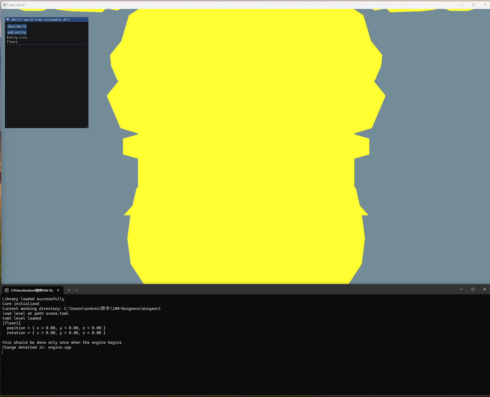

# 100 Dungeons


## Screen Capture of the First Dungeon's Current Engine Status

The engine currently renders static meshes only, with skinned animation support planned for future implementation.



## Showcase of Hot-reloading Capabilities

This example demonstrates hot-reloading by changing the unlit shader color. The engine supports multiple levels of hot-reloading:

- **`AnitraEngine.exe`**: The launcher executable that watches the `core` source folder and reloads `core.dll` when changes are detected.
- **`core.dll`**: Watches the `externals` and `engine` source folders to build and reload `externals.dll` and `engine.dll`.

Reloading `externals.dll` closes the window, but since memory is allocated in `core.dll`, the world state persists after reopening the window.

## Overview

**100 Dungeons** is a personal project inspired by the legendary Zelda games, aimed at designing 100 unique, immersive dungeons with classic Zelda-style gameplay in a 3D environment. This project is both a creative and technical challenge, allowing me to iterate on my game engine architecture while creating simple yet engaging dungeon experiences.

The current focus is on developing the engine for `dungeon1`, which is a continuation of my Anitra project. I plan to gradually migrate code from `1dungeon` (based on my earlier GP1 project) to `dungeon1`, combining Anitra with GP1 along with new features to enhance functionality.

Using `build.bat` scripts has replaced CMake for faster builds, with `clang` now handling the compilation. Setting up the `cl` compiler with `vcvars` proved challenging, as environment variables didn’t persist due to the engine calling the compiler internally. By contrast, `clang` installation sets the required paths automatically.

To build `dungeon1`, first run `setup_devenv.bat`, then `build_all.bat`. The `AnitraEngine.exe` will subsequently watch the `core` source folder and reload `core.dll` upon detecting changes. In turn, `core.dll` watches the `engine` and `externals` source folders to build and reload their respective DLLs, enabling a seamless hot-reloading workflow.

The engine builds upon systems from previous projects, incorporating modular design and real-time updates via hot-reloading and directory-watching features from [Anitra](https://github.com/andresfelipemendez/anitra). Additionally, the project draws on my experience [reimplementing](https://github.com/andresfelipemendez/GP1) examples from *Game Programming in C++* by Sanjay Madhav to create a streamlined development workflow.

For the scene description format, I’ve replaced JSON with TOML, which provides straightforward handling of data types without YAML's added complexity. I’m also developing a custom ECS tailored to this engine's needs, reusing my knowledge of manual memory layout from the [DirectX Pong Engine](https://github.com/andresfelipemendez/C-D3D11-Engine). This ECS gives me precise memory control from within the hot-reloaded DLLs, enhancing flexibility and performance.

## Features

- **Multi-level Hot-reloading**: The engine supports hot-reloading at multiple levels, enhancing development efficiency.
  - **Launcher (`AnitraEngine.exe`)**: Watches and reloads `core.dll` upon changes in the `core` source folder.
  - **Core DLL (`core.dll`)**: Watches and rebuilds `engine.dll` and `externals.dll` when changes are detected in their respective source folders.
- **Manually Designed Dungeons**: Each of the 100 dungeons will be unique, offering varied layouts and challenges.
- **Iterative Engine Development**: The engine undergoes continuous improvements, adding features tailored to dungeon creation and gameplay as development progresses.
- **Custom ECS Architecture**: A streamlined, custom-built ECS system allows direct memory management within the hot-reloaded DLLs, persisting the world state across DLL reloads.
- **OpenGL 4.5 Rendering**: Rendering is handled via OpenGL 4.5, providing extensive control over graphical output and flexibility in visual presentation.
- **GLTF for Mesh and Animation Loading**: The engine uses *fastgltf* to handle glTF assets, ensuring efficient loading of 3D models and animations.

## Libraries and Tools

- **[GLFW](https://github.com/glfw/glfw)**: Manages windowing and input handling.
- **[GLAD](https://glad.dav1d.de/)**: Loads OpenGL 4.5 extensions.
- **[GLM](https://github.com/g-truc/glm)**: A mathematics library used for OpenGL transformations.
- **[tomlc99](https://github.com/cktan/tomlc99)**: Parses TOML files for managing scene descriptions and configurations.
- **[fastgltf](https://github.com/spnda/fastgltf)**: Supports efficient loading of 3D models and animations in the glTF format.

## Prerequisites

To compile and run **100 Dungeons** locally, ensure you have the following setup:

1. **Operating System**: Windows (tested on Windows 11)

2. **Build Tools**:
   - **CMake** (version 3.12 or higher) - Required to configure the project and generate `compile_commands.json` for use with `clangd` in the Sublime Text LSP setup.
   - **Ninja** - Used alongside CMake to generate `compile_commands.json` for the LSP setup with `clangd`.
   - **Clang** - Install via **winget** for compilation and integration with `clangd`.
   - **Visual Studio** (latest 2022 version, with C++ development tools installed) - While `clang` handles the compilation, Visual Studio provides debugging tools and support for certain dependencies.

3. **Text Editor with LSP Support**:
   - **Sublime Text** with `clangd` - The project relies on `compile_commands.json` generated by CMake and Ninja to enable `clangd` for enhanced code completion and error-checking in Sublime Text.

4. **Graphics Driver**: Ensure that your graphics drivers are up-to-date to support OpenGL 4.5, which the engine uses.

## How to Run

1. **Install Dependencies**: Ensure you have the required libraries installed (GLFW, GLAD, GLM, etc.).

2. **Clone the Repository**:

   ```sh
   git clone https://github.com/andresfelipemendez/100-Dungeons.git
   cd 100-Dungeons
   ```

3. **Build the Project**:

   Use the provided build scripts to compile the code within each dungeon:

   ```batch
   cd dungeon#
   .\setup_devenv.bat
   .\build_all.bat
   .\run.bat
   ```

   Replace `#` with the specific dungeon number you want to build. This will generate the engine DLL with hot-reloading capability.

   The `AnitraEngine.exe` will automatically watch the `core` source folder and reload `core.dll` when changes are detected. Similarly, `core.dll` watches the `engine` and `externals` source folders to rebuild and reload `engine.dll` and `externals.dll`, respectively. This setup allows for a smooth development experience with minimal interruption.

## Roadmap

- **Combat and Puzzle Systems**: Implement basic enemy AI, combat mechanics, and puzzles that players can solve to progress.
- **Iteration on Engine Features**: Improve the underlying game engine to better support real-time rendering, collision detection, and other essential features.
- **Player Controls and Camera**: Implement smooth player movement and a dynamic camera to provide the best perspective for each dungeon.

## Acknowledgements

- **Nintendo's Zelda Series**: For endless inspiration in dungeon design and world-building.
- **Open Source Community**: Thanks to all contributors of the open-source libraries used in this project.