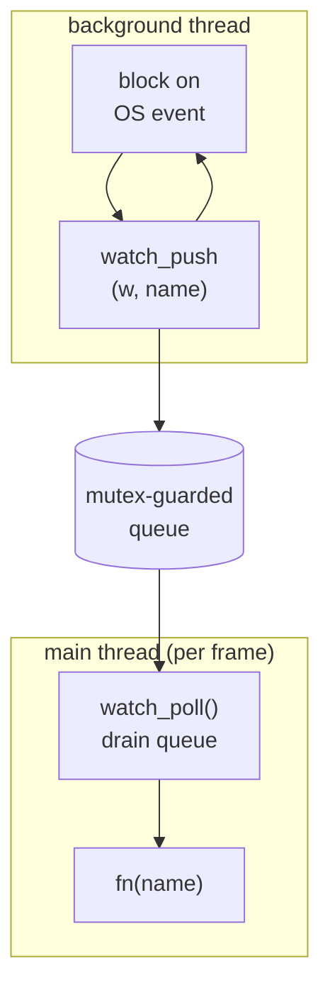

# 02 — The File Watcher

This is the biggest piece. Goal: notice when a file under `src/` changes, as fast as the OS can tell us, on every target platform — Windows, Linux, macOS, and Linux/arm64 (Raspberry Pi 5). And if the fancy path fails, fall back to something that always works.

## The core design decision: thread + queue

Every native file-event API **blocks**. `ReadDirectoryChangesW`, `read()` on an `inotify fd`, `kevent()` — they all park the calling thread until something changes. You cannot call them from your render loop; they'd freeze the frame.

So: **run the blocking wait on a background thread.** When an event arrives, the thread doesn't touch the game — it copies the changed filename into a small queue protected by a mutex. Once per frame, the main thread drains that queue and fires your callback.



Why drain on the main thread instead of calling `fn` straight from the bg thread? Because the callback ends up triggering a **GPU device reload** and a compiler subprocess. Doing that from a random worker thread while the main thread renders is a data race waiting to happen. Draining on the main thread means everything downstream (build, `SDL_LoadObject`, GPU idle/reload) stays single-threaded and safe — no locks needed anywhere except the tiny queue.

We use **SDL** for the thread, mutex, and atomic flag (`SDL_CreateThread`, `SDL_CreateMutex`, `SDL_AtomicInt`). Only the file-event syscalls are per-OS. That keeps the platform `#ifdef` blocks small and focused.

## The data: what a `Watcher` actually is

The design is data-first. There is exactly one piece of shared mutable state — the queue — and everything else is owned by whichever thread touches it. The struct is opaque in the header (`typedef struct Watcher Watcher;`) and fully defined only in the `.c` file, so the layout can differ per backend without changing the public interface.

The shape every backend shares:

```c
#define WATCH_QUEUE_MAX 64
#define WATCH_NAME_MAX  256

struct Watcher {
    char        queue[WATCH_QUEUE_MAX][WATCH_NAME_MAX];
    int         qcount;
    SDL_Mutex  *mutex;

    SDL_Thread *thread;
    SDL_AtomicInt running;

    WatchFn     fn;
    void       *user;
    char        dir[WATCH_NAME_MAX];
    const char *backend;
};
```

Three things are deliberate here:

The queue is a **fixed-size 2D array of chars**, not an array of pointers to heap strings. A change event copies one name into a slot — no `malloc`, no ownership question, no free list. The whole queue is one contiguous block you can clear by setting `qcount = 0`. The cost is a fixed ceiling (`WATCH_QUEUE_MAX` names, `WATCH_NAME_MAX` bytes each) and slightly larger struct, which is exactly the trade you want: predictable memory, zero allocator traffic on the hot path, and a locked section that does nothing but copy bytes.

`running` is an `SDL_AtomicInt`, not a plain `int`, because it is read on the worker thread and written on the main thread. Atomic load/store gives you a defined cross-thread read without a full mutex.

Each backend appends its own fields after these (a Windows `HANDLE`, a Linux `ino_fd`/`stop_fd` pair, a macOS array of `{fd, name}` plus a `kq`). The shared front matter is identical, so `watch_create`/`watch_poll`/`watch_destroy` read the same regardless of platform.

## The public interface (`watch.h`)

This is the entire exported surface — four functions and two types:

```c
typedef struct Watcher Watcher;
typedef void (*WatchFn)(const char *name, void *user);

Watcher    *watch_create(const char *dir, WatchFn fn, void *user);
void        watch_poll(Watcher *w);
void        watch_destroy(Watcher *w);
const char *watch_backend(Watcher *w);
```

`watch_create` opens the backend and spawns the thread; it returns `NULL` only if even the poll fallback can't start. `watch_poll` is called once per frame and fires `fn` on the calling thread. `watch_destroy` stops the thread and releases everything. `watch_backend` returns one of `"inotify"`, `"ReadDirectoryChangesW"`, `"kqueue"`, or `"poll"`.

**Why the callback only gets a basename:** all four backends can cheaply give us the bare filename (`game.c`), but full paths differ in format and effort per backend. The consumer only needs the extension to decide "is this code or a shader?" — so basename is the common, sufficient currency. `watch_backend()` exists purely so the engine can log *which* path is active; when something misbehaves you immediately know if you're on the native API or the fallback.

**What is *not* in this header, and why:** everything else. The `Watcher` struct body, the queue constants, and every helper below live in the `.c` files. The header is the contract; the implementation is private. This matters for the next section.

## `watch_push` — an internal helper, not part of the API

If you grepped `watch.h` for `watch_push` and didn't find it, that's correct and intentional. `watch_push` is a `static` function inside each backend's `.c` file. `static` at file scope means it has **internal linkage** — it isn't exported in the object file's symbol table and cannot be called or even named from another translation unit. It is the one routine every backend uses to get a name into the shared queue, but it is an implementation detail, so it never appears in the public header.

```c
static void watch_push(Watcher *w, const char *name) {
    SDL_LockMutex(w->mutex);
    for (int i = 0; i < w->qcount; ++i)
        if (SDL_strcmp(w->queue[i], name) == 0) { SDL_UnlockMutex(w->mutex); return; }
    if (w->qcount < WATCH_QUEUE_MAX)
        SDL_strlcpy(w->queue[w->qcount++], name, WATCH_NAME_MAX);
    SDL_UnlockMutex(w->mutex);
}
```

Two correctness points, both about keeping the locked region as small and cheap as possible:

**Dedup.** Saving one file can emit several OS events (a "modify" then a "close-write", or many `IN_MODIFY` as the editor writes in chunks). Without dedup the queue fills with the same name and you'd build several times. The linear scan collapses duplicates *before* they enter the queue, so the main thread sees each changed file at most once per drain. With `WATCH_QUEUE_MAX` at 64 the scan is trivially cheap, and it runs while you already hold the lock anyway.

**Bounded copy.** The `qcount < WATCH_QUEUE_MAX` guard means a flood of events can never overrun the array — excess names are simply dropped (the file's still changed on disk; the next poll cycle or a later event picks it up). `SDL_strlcpy` always null-terminates and never writes past `WATCH_NAME_MAX`. The locked section does nothing but compare and copy fixed-size bytes — no syscalls, no allocation — so the worker thread holds the mutex for microseconds.

Each backend section below ends with a call to this function. That is the single point where per-OS code hands off to the shared, platform-agnostic core.

## Backend 1 — Windows: `ReadDirectoryChangesW`

```c
BOOL ok = ReadDirectoryChangesW(h, buf, sizeof(buf), FALSE,
    FILE_NOTIFY_CHANGE_LAST_WRITE | FILE_NOTIFY_CHANGE_FILE_NAME,
    &bytes, NULL, NULL);
```

`h` is a handle to the **directory**, opened with `FILE_FLAG_BACKUP_SEMANTICS` — the flag that lets you open a directory as a handle at all — and shared for read/write/delete so we never block the editor or compiler from touching files. The `FALSE` argument is the "watch subtree" flag, off here because `src/` is flat. We watch `LAST_WRITE` (content saved) and `FILE_NAME` (create/rename), which together cover editors that save by writing a temp file and renaming over the original.

The call fills `buf` with a packed list of variable-length `FILE_NOTIFY_INFORMATION` records. Each record's `NextEntryOffset` is a byte offset to the next one (zero marks the last), so you walk the buffer by casting and advancing a `char *` pointer by that offset rather than by `sizeof`. For each record we convert the UTF-16 `FileName` to UTF-8 with `WideCharToMultiByte`, then call `watch_push`.

**The stop problem (important):** the worker is blocked *inside* `ReadDirectoryChangesW`. Setting a flag won't wake it. Closing the handle alone is unreliable. The reliable wake is, from the main thread in `watch_destroy`:

```c
CancelIoEx(h, NULL);
CloseHandle(h);
```

`CancelIoEx` cancels pending I/O on the handle from any thread, so the blocked `ReadDirectoryChangesW` returns `FALSE`, the loop sees `running == 0`, and the thread exits cleanly. Without this, `watch_destroy` would hang forever on `SDL_WaitThread`.

## Backend 2 — Linux (incl. Pi 5): `inotify` + `eventfd`

```c
w->ino_fd = inotify_init1(0);
inotify_add_watch(w->ino_fd, w->dir, IN_CLOSE_WRITE | IN_MOVED_TO | IN_MODIFY);
```

`IN_CLOSE_WRITE` fires when a file that was open for writing is closed — the cleanest "the save is finished" signal. `IN_MOVED_TO` catches atomic-rename saves (vim and many editors write `file~` then rename over `file`). `IN_MODIFY` catches in-place writes; it's noisier and can fire mid-write, but the debounce in doc 04 absorbs that.

inotify events also arrive packed: `read(ino_fd)` returns a buffer of variable-length `struct inotify_event` records, each followed by a `len`-byte name, walked the same way as the Windows records.

**The stop problem again:** the worker blocks in `read(ino_fd)`. We solve it with an `eventfd` plus `poll`:

```c
struct pollfd pfds[2] = { {ino_fd, POLLIN}, {stop_fd, POLLIN} };
poll(pfds, 2, -1);
if (pfds[1].revents & POLLIN) break;
```

`poll` sleeps on both fds at once. `watch_destroy` writes 8 bytes to `stop_fd`; `poll` wakes, we see the stop fd is ready, and break. This is the standard "self-pipe / eventfd wakeup" trick for interrupting a blocking syscall without signals — signals are global and fiddly, an eventfd is local and clean. **The Pi 5 arm64 target uses this exact path.** inotify is a kernel feature and architecture-independent, so there is no special-casing for ARM — same source, same backend, just a different compiler triple.

## Backend 3 — macOS: `kqueue`

macOS has no inotify. The two options are FSEvents (needs a CoreFoundation run-loop) and `kqueue` (a plain fd you can `kevent()` on a thread). We use `kqueue` — no run-loop, fits the thread+queue model with zero extra machinery.

`kqueue`'s quirk: `EVFILT_VNODE` watches an **open file descriptor**, not a path. So on startup we `opendir`, then `open(file, O_EVTONLY)` each regular file and register it:

```c
EV_SET(&ev, fd, EVFILT_VNODE, EV_ADD | EV_CLEAR,
       NOTE_WRITE | NOTE_EXTEND | NOTE_DELETE | NOTE_RENAME | NOTE_ATTRIB,
       0, (void *)(intptr_t)idx);
```

`O_EVTONLY` is a watch-only descriptor that doesn't count as a real open, so it won't block an unmount. The last argument is `udata`: we stash the file's index in our `files[]` array there, so when an event fires we know *which* file without searching — the kernel hands the index straight back to us.

**The atomic-save trap:** an editor that saves by renaming a temp over your file makes a **new inode**. Your fd still points at the old, now-orphaned inode — it'll never fire again. So when we see `NOTE_DELETE | NOTE_RENAME`, we close the dead fd, re-`open` the path, and re-register:

```c
if (ev.fflags & (NOTE_DELETE | NOTE_RENAME)) {
    close(w->files[idx].fd);
    w->files[idx].fd = open(full, O_EVTONLY);
    if (w->files[idx].fd >= 0) mac_register(w, idx);
}
```

Without this, the first atomic save would silently stop watching that file forever. Stop uses a `pipe` registered as `EVFILT_READ`, the same idea as the Linux eventfd.

## Backend 4 — Portable poll fallback

If a native backend fails to initialize (or you build on a platform we didn't special-case), we fall back to polling with **SDL-only** calls, so it works literally anywhere SDL runs:

```c
char **names = SDL_GlobDirectory(w->dir, NULL, 0, &count);
SDL_GetPathInfo(full, &pi);
if (first_time_seeing_file) cache_mtime(full, pi.modify_time);
else if (pi.modify_time != cached) watch_push(w, name);
```

Two deliberate choices:

**First sight never fires.** On startup we record every file's mtime without queuing it. Otherwise the very first poll would report all files as "changed" and trigger a build storm before you've touched anything.

**~200 ms cadence, checked in 20×10 ms slices** so `watch_destroy` (which sets `running = 0`) is honored within ~10 ms instead of waiting a full sleep. Polling trades latency and a little CPU for total portability — it's the safety net, not the default.

## Lifecycle: create / poll / destroy

```c
watch_create:  try backend_start();  native? -> spawn watch_thread
                                      else    -> backend = "poll", spawn poll_thread
watch_poll:    lock, copy queue out, reset count, unlock, then fire fn() per item
watch_destroy: running = 0; (native? backend_stop to unblock); WaitThread; (native? backend_cleanup)
```

The ordering in `watch_destroy` matters: **signal/cancel the blocking call first, *then* `SDL_WaitThread`, *then* close fds/handles.** Reverse it and you either hang (waiting on a thread that's still blocked) or crash (closing an fd the thread is mid-syscall on).

`watch_poll` copies the queue into a local array *before* releasing the lock and calling `fn`, so your callback — which may run a multi-second compile — never holds the mutex while the bg thread wants to push:

```c
void watch_poll(Watcher *w) {
    char local[WATCH_QUEUE_MAX][WATCH_NAME_MAX];
    int  n;
    SDL_LockMutex(w->mutex);
    n = w->qcount;
    for (int i = 0; i < n; ++i) SDL_strlcpy(local[i], w->queue[i], WATCH_NAME_MAX);
    w->qcount = 0;
    SDL_UnlockMutex(w->mutex);
    for (int i = 0; i < n; ++i) w->fn(local[i], w->user);
}
```

That copy-then-unlock is the whole reason the locked region stays bounded: the slow work (firing `fn`) happens entirely outside the lock.

## Compiling per platform in CMake

The watcher is one header plus exactly one backend `.c` per build — you never compile more than one. Each backend lives in its own translation unit under `src/platform/`:

```
src/watch.h
src/platform/watch_windows.c
src/platform/watch_linux.c
src/platform/watch_macos.c
src/platform/watch_poll.c
```

Select the backend source with CMake's platform variables and add it to the targets that need it (here, `engine`). The variable is named `PLATFORM_SRC` rather than `WATCH_SRC` because this per-OS file is where *all* platform-dependent code lives — the watcher backend is just its first occupant. Put this in `CMakeLists.txt` after the `add_executable(engine ...)` line:

```cmake
if(WIN32)
    set(PLATFORM_SRC src/platform/watch_windows.c)
elseif(CMAKE_SYSTEM_NAME STREQUAL "Linux")
    set(PLATFORM_SRC src/platform/watch_linux.c)
elseif(APPLE)
    set(PLATFORM_SRC src/platform/watch_macos.c)
else()
    set(PLATFORM_SRC src/platform/watch_poll.c)
endif()

target_sources(engine PRIVATE ${PLATFORM_SRC})
```

If the per-OS code outgrows a single file, make `PLATFORM_SRC` a list — `set(PLATFORM_SRC src/platform/watch_linux.c src/platform/audio_linux.c)` — and `target_sources` takes them all; the selection logic stays the same.

Notes that matter:

`CMAKE_SYSTEM_NAME` is `"Linux"` for both x86-64 and arm64 (the Pi 5) — there is no separate arm branch, because, as above, inotify is architecture-independent. The same `watch_linux.c` compiles for both; only the toolchain/triple differs, which CMake handles outside this file. If you cross-compile for the Pi, point CMake at the arm64 toolchain via a preset or `-DCMAKE_TOOLCHAIN_FILE=...`; this selection logic doesn't change.

`WIN32` is true on all Windows builds (32- and 64-bit, MSVC or MinGW). `APPLE` is true on macOS. The final `else()` is the safety net: any platform we didn't name gets the portable poll backend, matching the runtime fallback. You can also force it everywhere for testing with `-DWATCH_FORCE_POLL=ON` guarding the `set()`.

The backends use no extra link libraries — inotify, `ReadDirectoryChangesW`, and `kqueue` are all in the C library / base OS libs already pulled in. Everything threading-related comes from `SDL3::SDL3`, which `engine` already links. So there is nothing to add to `target_link_libraries` for the watcher.

If you build the platform code into a separate library instead of straight into `engine`, the pattern is identical — `add_library(platform STATIC ${PLATFORM_SRC} src/watch.h)`, give it `target_include_directories(platform PUBLIC src)`, link `SDL3::SDL3`, then `target_link_libraries(engine PRIVATE platform)`.

## Using it from `main` (and the directory-path trap)

The minimal shape: create the watcher once *before* the loop, drain it once *inside* the loop, destroy it once *after*:

```c
Watcher *watcher = watch_create(WATCH_DIR, on_file_changed, &hot);
if (watcher) SDL_Log("watching %s via %s", WATCH_DIR, watch_backend(watcher));

while (running) {
    if (watcher) watch_poll(watcher);
    ...
}

if (watcher) watch_destroy(watcher);
```

`watch_poll` must run every frame on the main thread — that's the half of the design that fires your callback. Putting `watch_create` before `while (running)` is correct; just don't forget the poll inside the loop and the destroy after it. (The real callback — routing `.c`/`.h` to a rebuild — is doc 04; here `on_file_changed` can be a stub that just logs the name.)

**Now the path.** Passing a *relative* path like `"src"` is the trap you've hit. Every backend ultimately hands that string to an OS call (`inotify_add_watch`, `opendir`, `CreateFile`), and the OS resolves a relative path against the process's **current working directory (cwd)** — not the executable's location, and not the project root. The cwd is whatever the *launcher* chose:

- run from a dev shell → wherever you `cd`'d
- double-click in Explorer/Finder → often the exe's own dir, or something system-ish
- launched by CLion/VS → a configured "working directory", usually the build dir

Your exe lives somewhere like `out/build/x64-debug/Debug/engine.exe`, and that location changes per preset and per platform. So there is **no fixed relative path** from the running exe back to `src/` — `"src"` only happens to work when cwd coincidentally contains a `src/`. That's the whole confusion.

The fix is to not use a runtime-relative path at all. **Bake the absolute source path in at configure time with a CMake compile definition** — the exact same trick you already use for `GAME_LIB_PATH`:

```cmake
target_compile_definitions(engine PRIVATE
    WATCH_DIR="${CMAKE_CURRENT_SOURCE_DIR}/src")
```

`CMAKE_CURRENT_SOURCE_DIR` is the absolute path to the directory holding this `CMakeLists.txt` on the machine that configured the build, so `WATCH_DIR` becomes a fixed absolute path like `C:/Users/andres/Developer/100-Dungeons/src`. It's independent of cwd, of where the exe ends up, and of the build platform. Then `watch_create(WATCH_DIR, ...)` always watches the real source tree.

Why is an absolute *build-machine* path acceptable here when it would be wrong for a shipped game? Because hot-reload is a **developer-only** feature — it watches and recompiles source that only exists on your dev machine. You'd never ship it, so "the path that was correct when this was built" is exactly the right semantics. (`SDL_GetBasePath()` gives the exe's directory at runtime, which is the right tool for locating *shipped assets* — but it can't reliably find your source tree, so it's the wrong tool for the watcher.)

Doc 04 wires this same define as `HOTBUILD_WATCH_DIR` alongside the compiler and SDL paths; if you've already read it, this is the same idea isolated. `CMAKE_CURRENT_SOURCE_DIR` vs `CMAKE_SOURCE_DIR`: the former is the current `CMakeLists.txt`'s directory, the latter the top-level one — identical in your single-file setup, but reach for `CURRENT` so it keeps working if you ever split into subdirectories.

## What the callback does

Nothing in the watcher decides *what a change means* — it just reports names. Routing ("`.c`/`.h` → rebuild, `.hlsl` → recompile shader") lives in the engine callback, covered in [04-wiring.md](04-wiring.md). That separation is intentional: the watcher is a reusable "tell me when files here change" component; policy lives in the engine.
