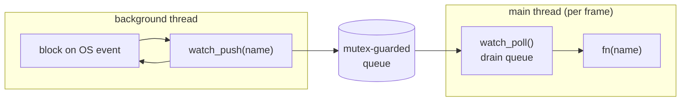

# 02 — The File Watcher

This is the biggest piece. Goal: notice when a file under `src/` changes, as fast as the OS can tell us, on every target platform — Windows, Linux, macOS, and Linux/arm64 (Raspberry Pi 5). And if the fancy path fails, fall back to something that always works.

## The core design decision: thread + queue

Every native file-event API **blocks**. `ReadDirectoryChangesW`, `read()` on an inotify fd, `kevent()` — they all park the calling thread until something changes. You cannot call them from your render loop; they'd freeze the frame.

So: **run the blocking wait on a background thread.** When an event arrives, the thread doesn't touch the game — it just drops the changed filename into a small queue protected by a mutex. Once per frame, the main thread drains that queue and fires your callback.



Why drain on the main thread instead of building straight from the bg thread? Because the callback ends up triggering a **GPU device reload** and a compiler subprocess. Doing that from a random worker thread while the main thread renders is a data race waiting to happen. Draining on the main thread means everything downstream (build, `SDL_LoadObject`, GPU idle/reload) stays single-threaded and safe — no locks needed anywhere except the tiny queue.

We use **SDL** for the thread, mutex, and atomic flag (`SDL_CreateThread`, `SDL_CreateMutex`, `SDL_AtomicInt`). Only the file-event syscalls are per-OS. That keeps the platform `#ifdef` blocks small and focused.

## The interface (`watch.h`)

```c
typedef struct Watcher Watcher;
typedef void (*WatchFn)(const char *name, void *user);   // name = basename, e.g. "game.c"

Watcher    *watch_create(const char *dir, WatchFn fn, void *user);
void        watch_poll(Watcher *w);     // call once per frame; fires fn on this thread
void        watch_destroy(Watcher *w);
const char *watch_backend(Watcher *w);  // "inotify" | "ReadDirectoryChangesW" | "kqueue" | "poll"
```

**Why the callback only gets a basename:** all four backends can cheaply give us the bare filename (`game.c`), but full paths differ in format and effort per backend. The consumer only needs the extension to decide "is this code or a shader?" — so basename is the common, sufficient currency. `watch_backend()` exists purely so the engine can log *which* path is active; when something misbehaves you immediately know if you're on the native API or the fallback.

## `watch_push` — the shared queue writer

```c
static void watch_push(Watcher *w, const char *name) {
    SDL_LockMutex(w->mutex);
    for (int i = 0; i < w->qcount; ++i)
        if (SDL_strcmp(w->queue[i], name) == 0) { SDL_UnlockMutex(w->mutex); return; } // dedup
    if (w->qcount < WATCH_QUEUE_MAX)
        SDL_strlcpy(w->queue[w->qcount++], name, WATCH_NAME_MAX);
    SDL_UnlockMutex(w->mutex);
}
```

**Why dedup:** saving one file can emit several OS events (a "modify" then a "close-write", or many `IN_MODIFY` as the editor writes in chunks). Without dedup the queue fills with the same name and you'd build several times. Collapsing duplicates here means the main thread sees each changed file at most once per drain. The fixed-size array (no malloc) keeps the locked section tiny — copy a string, unlock. Hold a mutex for as little time as possible.

## Backend 1 — Windows: `ReadDirectoryChangesW`

```c
BOOL ok = ReadDirectoryChangesW(h, buf, sizeof(buf), FALSE,
    FILE_NOTIFY_CHANGE_LAST_WRITE | FILE_NOTIFY_CHANGE_FILE_NAME,
    &bytes, NULL, NULL);
```

- `h` is a handle to the **directory**, opened with `FILE_FLAG_BACKUP_SEMANTICS` (the magic flag that lets you open a directory as a handle) and shared for read/write/delete so we never block the editor or compiler from touching files.
- `FALSE` = non-recursive (your `src/` is flat).
- We watch `LAST_WRITE` (content saved) and `FILE_NAME` (create/rename — covers editors that save by writing a temp file and renaming over the original).
- The call fills `buf` with a packed list of `FILE_NOTIFY_INFORMATION` records; we walk them via `NextEntryOffset`, convert each UTF-16 `FileName` to UTF-8 with `WideCharToMultiByte`, and push.

**The stop problem (important):** the worker is blocked *inside* `ReadDirectoryChangesW`. Setting a flag won't wake it. Closing the handle alone is unreliable. The reliable wake is, from the main thread in `watch_destroy`:

```c
CancelIoEx(h, NULL);   // forces the blocked call to return FALSE
CloseHandle(h);
```

`CancelIoEx` cancels pending I/O on the handle from any thread, so the blocked `ReadDirectoryChangesW` returns immediately, the loop sees `running == 0`, and the thread exits cleanly. Without this, `watch_destroy` would hang forever on `SDL_WaitThread`.

## Backend 2 — Linux (incl. Pi 5): `inotify` + `eventfd`

```c
w->ino_fd = inotify_init1(0);
inotify_add_watch(w->ino_fd, w->dir, IN_CLOSE_WRITE | IN_MOVED_TO | IN_MODIFY);
```

- `IN_CLOSE_WRITE` — file opened for writing was closed = a completed save. The cleanest "the file is done being written" signal.
- `IN_MOVED_TO` — atomic-rename saves (vim, many editors write `file~` then rename over `file`).
- `IN_MODIFY` — in-place writes; noisier (can fire mid-write) but our debounce (doc 04) absorbs that.

**The stop problem again:** the worker blocks in `read(ino_fd)`. We solve it with an `eventfd` + `poll`:

```c
struct pollfd pfds[2] = { {ino_fd, POLLIN}, {stop_fd, POLLIN} };
poll(pfds, 2, -1);                 // sleeps on BOTH fds
if (pfds[1].revents & POLLIN) break;   // stop_fd was written → exit
```

`watch_destroy` writes 8 bytes to `stop_fd`; `poll` wakes, we see the stop fd is ready, and break. This is the standard "self-pipe / eventfd wakeup" trick for interrupting a blocking syscall without signals (signals are global and fiddly; an eventfd is local and clean). **The Pi 5 arm64 target uses this exact path** — inotify is a kernel feature, architecture-independent, so no special-casing for ARM.

## Backend 3 — macOS: `kqueue`

macOS has no inotify. The two options are FSEvents (needs a CoreFoundation run-loop) and `kqueue` (a plain fd you can `kevent()` on a thread). We use `kqueue` — no run-loop, fits the thread+queue model with zero extra machinery.

`kqueue`'s quirk: `EVFILT_VNODE` watches an **open file descriptor**, not a path. So on startup we `opendir`, then `open(file, O_EVTONLY)` each regular file and register it:

```c
EV_SET(&ev, fd, EVFILT_VNODE, EV_ADD | EV_CLEAR,
       NOTE_WRITE | NOTE_EXTEND | NOTE_DELETE | NOTE_RENAME | NOTE_ATTRIB,
       0, (void *)(intptr_t)idx);   // udata carries the file index back to us
```

- `O_EVTONLY` — a watch-only descriptor that doesn't count as a real open (won't block unmount, etc.).
- We stash the file's index in `udata`, so when an event fires we know *which* file without searching.

**The atomic-save trap:** an editor that saves by renaming a temp over your file makes a **new inode**. Your fd still points at the old, now-orphaned inode — it'll never fire again. So when we see `NOTE_DELETE | NOTE_RENAME`, we close the dead fd, re-`open` the path, and re-register:

```c
if (ev.fflags & (NOTE_DELETE | NOTE_RENAME)) {
    close(w->files[idx].fd);
    w->files[idx].fd = open(full, O_EVTONLY);
    if (w->files[idx].fd >= 0) mac_register(w, idx);
}
```

Without this, the first atomic save would silently stop watching that file forever. Stop uses a `pipe` registered as `EVFILT_READ`, same idea as the Linux eventfd.

## Backend 4 — Portable poll fallback

If a native backend fails to initialize (or you build on a platform we didn't special-case), we fall back to polling with **SDL-only** calls, so it works literally anywhere SDL runs:

```c
char **names = SDL_GlobDirectory(w->dir, NULL, 0, &count);
... SDL_GetPathInfo(full, &pi);          // pi.modify_time
if (first time seeing file) cache mtime; // do NOT fire
else if (mtime changed)     watch_push;  // fire
```

Two deliberate choices:

- **First sight never fires.** On startup we record every file's mtime without queuing it. Otherwise the very first poll would report all files as "changed" and trigger a build storm before you've touched anything.
- **~200 ms cadence, checked in 20×10 ms slices** so `watch_destroy` (which sets `running = 0`) is honored within ~10 ms instead of waiting a full sleep. Polling trades latency and a little CPU for total portability — it's the safety net, not the default.

## Lifecycle: create / poll / destroy

```c
watch_create:  try backend_start();  native? → spawn watch_thread
                                      else    → backend="poll", spawn poll_thread
watch_poll:    lock, copy queue out, reset count, unlock, then fire fn() per item
watch_destroy: running = 0; (native? backend_stop to unblock); WaitThread; (native? backend_cleanup)
```

The ordering in `watch_destroy` matters: **signal/cancel the blocking call first, *then* `SDL_WaitThread`, *then* close fds/handles.** Reverse it and you either hang (waiting on a thread that's still blocked) or crash (closing an fd the thread is mid-syscall on). `watch_poll` copies the queue into a local array *before* releasing the lock and calling `fn`, so your callback — which may run a multi-second compile — never holds the mutex while the bg thread wants to push.

## What the callback does

Nothing in the watcher decides *what a change means* — it just reports names. Routing ("`.c`/`.h` → rebuild, `.hlsl` → recompile shader") lives in the engine callback, covered in [04-wiring.md](04-wiring.md). That separation is intentional: the watcher is a reusable "tell me when files here change" component; policy lives in the engine.
