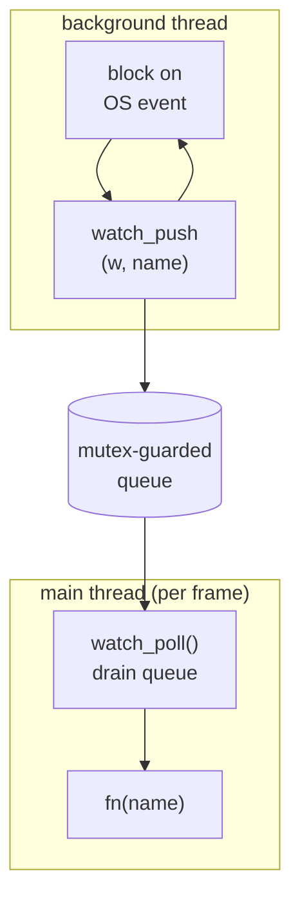

# 02 — The File Watcher

This is the biggest piece. Goal: notice when a file under `src/` changes, as fast as the OS can tell us, and hand the changed filename to the engine. Today the engine targets Windows, so **Windows is the only backend that exists** — `src/platform/windows.c`. The design is built so Linux, macOS, and a portable fallback drop in later behind the same `watch.h` interface without touching the engine; those are sketched at the end as future ports, not working code yet.

## The core design decision: thread + queue

Every native file-event API **blocks**. `ReadDirectoryChangesW` on Windows, `read()` on an inotify fd on Linux, `kevent()` on macOS — they all park the calling thread until something changes. You cannot call them from your render loop; they'd freeze the frame.

So: **run the blocking wait on a background thread.** When an event arrives, the thread doesn't touch the game — it copies the changed filename into a small queue protected by a mutex. Once per frame, the main thread drains that queue and fires your callback.



Why drain on the main thread instead of calling `fn` straight from the bg thread? Because the callback ends up triggering a **GPU device reload** and a compiler subprocess. Doing that from a random worker thread while the main thread renders is a data race waiting to happen. Draining on the main thread means everything downstream (build, `SDL_LoadObject`, GPU idle/reload) stays single-threaded and safe — no locks needed anywhere except the tiny queue.

We use **SDL** for the thread, mutex, and atomic flag (`SDL_CreateThread`, `SDL_CreateMutex`, `SDL_AtomicInt`). Only the file-event syscalls are per-OS. That keeps the platform-specific code small and contained.

## One file per platform

The whole watcher is two kinds of file:

```
src/watch.h               the public interface — same on every OS
src/platform/windows.c    the Windows implementation (this is what exists)
```

Later ports add `src/platform/linux.c`, `macos.c`, and `poll.c`. **CMake compiles exactly one of them** per build (the selection logic is below). Each platform file is *self-contained*: it defines the full `Watcher` struct, the shared queue helper, and the four public functions. There is no shared `watch.c`. That means the queue/`watch_push`/`watch_poll` code is repeated in each platform file — a deliberate trade. With four small files the duplication is a few dozen lines, and in exchange every backend is one file you can read top to bottom with no jumping around, and there are zero `#ifdef` thickets. The parts that are genuinely identical across files are called out below so you know what carries over verbatim when you write `linux.c`.

## The public interface (`watch.h`)

This is the entire exported surface — four functions and two types. It already exists in your tree:

```c
typedef struct Watcher Watcher;
typedef void (*WatchFn)(const char *name, void *user);

Watcher    *watch_create(const char *dir, WatchFn fn, void *user);
void        watch_poll(Watcher *w);
void        watch_destroy(Watcher *w);
const char *watch_backend(Watcher *w);
```

`watch_create` opens the backend and spawns the thread; it returns `NULL` if the watcher can't start (e.g. the directory can't be opened). `watch_poll` runs once per frame and fires `fn` on the calling thread. `watch_destroy` stops the thread and releases everything. `watch_backend` returns a static string naming the active path — on Windows, `"ReadDirectoryChangesW"`.

`Watcher` is **opaque**: the header only forward-declares it (`typedef struct Watcher Watcher;`) and the full struct is defined inside each platform `.c`. That's what lets `windows.c` carry an `HANDLE` and `linux.c` carry an `int` fd in the same-named struct without the interface ever knowing.

**Why the callback only gets a basename.** `WatchFn` receives `name` = the bare filename like `game.c`, not a full path. Every backend can produce the bare name cheaply, but full paths differ in format and effort per backend, and the consumer only needs the extension to decide "is this code or a shader?" So basename is the common, sufficient currency. The second parameter, `user`, is explained in "Using it from `main`" below.

## The Windows backend — `src/platform/windows.c`

Here is the whole file, built up in pieces. Type it understanding each part; the prose after each block is the *why*.

### Header, constants, struct

```c
#include "watch.h"
#include <SDL3/SDL.h>
#include <windows.h>

#define WATCH_QUEUE_MAX 64
#define WATCH_NAME_MAX  256

struct Watcher {
    char          queue[WATCH_QUEUE_MAX][WATCH_NAME_MAX];
    int           qcount;
    SDL_Mutex    *mutex;

    SDL_Thread   *thread;
    SDL_AtomicInt running;

    WatchFn       fn;
    void         *user;

    HANDLE        dir;
    HANDLE        ev_change;
    HANDLE        ev_stop;
};
```

The first block of fields is the **shared shape** — identical in every platform file. The queue is a fixed-size 2D array of chars, not an array of heap pointers: a change event copies one name into a slot, so there's no `malloc`, no ownership question, no free list, and the locked section does nothing but copy bytes. The cost is a fixed ceiling (`WATCH_QUEUE_MAX` names of `WATCH_NAME_MAX` bytes), which is exactly the trade you want for a hot path. `running` is an `SDL_AtomicInt` because it's written on the main thread (in `watch_destroy`) and read on the worker thread; atomic load/store gives a defined cross-thread read without a full mutex.

The last three fields are **Windows-specific**: `dir` is the directory handle we watch, and the two events drive a clean shutdown (next section). `linux.c` would replace these three with an inotify fd and a stop fd; nothing above them changes.

### The shared queue writer — `watch_push`

```c
static void watch_push(Watcher *w, const char *name) {
    SDL_LockMutex(w->mutex);
    for (int i = 0; i < w->qcount; ++i)
        if (SDL_strcmp(w->queue[i], name) == 0) { SDL_UnlockMutex(w->mutex); return; }
    if (w->qcount < WATCH_QUEUE_MAX)
        SDL_strlcpy(w->queue[w->qcount++], name, WATCH_NAME_MAX);
    SDL_UnlockMutex(w->mutex);
}
```

`static` means file-internal linkage — this is not exported and is not in `watch.h`; it's an implementation detail every backend shares verbatim. Two correctness points, both about keeping the locked region tiny. **Dedup:** saving one file can emit several OS events (a write then a close, or several chunks). The linear scan collapses duplicates before they enter the queue, so the main thread sees each changed file at most once per drain; with `WATCH_QUEUE_MAX` at 64 the scan is trivially cheap. **Bounded copy:** the `qcount < WATCH_QUEUE_MAX` guard means a flood can never overrun the array — excess names are dropped (the file's still changed on disk; a later event re-reports it), and `SDL_strlcpy` always null-terminates within `WATCH_NAME_MAX`. No syscalls, no allocation inside the lock — the worker holds the mutex for microseconds.

### The worker thread

This is where the actual Windows magic lives. The key decision: **overlapped (asynchronous) I/O** so we can wait on the directory *and* a stop signal at the same time.

```c
static int SDLCALL watch_thread(void *data) {
    Watcher *w = (Watcher *)data;
    DWORD buf[2048];
    OVERLAPPED ov;

    while (SDL_GetAtomicInt(&w->running)) {
        SDL_zero(ov);
        ov.hEvent = w->ev_change;

        if (!ReadDirectoryChangesW(w->dir, buf, sizeof(buf), FALSE,
                FILE_NOTIFY_CHANGE_LAST_WRITE | FILE_NOTIFY_CHANGE_FILE_NAME,
                NULL, &ov, NULL))
            break;

        HANDLE waits[2] = { w->ev_change, w->ev_stop };
        DWORD which = WaitForMultipleObjects(2, waits, FALSE, INFINITE);
        if (which != WAIT_OBJECT_0) {
            CancelIoEx(w->dir, &ov);
            break;
        }

        DWORD bytes = 0;
        if (!GetOverlappedResult(w->dir, &ov, &bytes, FALSE) || bytes == 0)
            continue;

        FILE_NOTIFY_INFORMATION *fni = (FILE_NOTIFY_INFORMATION *)buf;
        for (;;) {
            int wlen = (int)(fni->FileNameLength / sizeof(WCHAR));
            char name[WATCH_NAME_MAX];
            int n = WideCharToMultiByte(CP_UTF8, 0, fni->FileName, wlen,
                                        name, (int)sizeof(name) - 1, NULL, NULL);
            if (n > 0) {
                name[n] = '\0';
                watch_push(w, name);
            }
            if (fni->NextEntryOffset == 0) break;
            fni = (FILE_NOTIFY_INFORMATION *)((char *)fni + fni->NextEntryOffset);
        }
    }
    return 0;
}
```

Walking through it:

`buf` is declared as `DWORD[2048]` (8192 bytes), not `char[8192]`, on purpose — `FILE_NOTIFY_INFORMATION` records must be DWORD-aligned, and a `char` array carries no such guarantee. Declaring it as `DWORD` gives the alignment for free; we cast to `char *` only when stepping by byte offsets.

`ReadDirectoryChangesW` is issued **asynchronously**: we pass an `OVERLAPPED` (`&ov`) and `NULL` for the bytes-returned pointer. The call returns immediately, having queued the read; `ov.hEvent` (our `ev_change`) becomes signaled when a change actually lands. `FALSE` is the "watch subtree" flag, off because `src/` is flat. We watch `LAST_WRITE` (content saved) and `FILE_NAME` (create/rename), which together cover editors that save by writing a temp file and renaming over the original.

`WaitForMultipleObjects` sleeps on **both** `ev_change` and `ev_stop`. This is the whole reason for overlapped I/O: a synchronous blocking `ReadDirectoryChangesW` could only be unblocked by `CancelIoEx`, which races with the moment the call enters the kernel and can deadlock on shutdown. Waiting on two events has no such race — a change wakes us via `ev_change`, and `watch_destroy` wakes us via `ev_stop`. If the wake was `ev_stop` (`which != WAIT_OBJECT_0`), we cancel the still-pending read and exit the thread. `ev_change` is an auto-reset event (the wait clears it); `ev_stop` is manual-reset so once set it stays set.

On a real change, `GetOverlappedResult(..., FALSE)` fetches how many bytes the read produced without waiting (the I/O is already complete). `bytes == 0` means the kernel's internal buffer overflowed and it couldn't tell us specifics — we just skip and re-arm; the next save re-reports.

Then we walk the packed records. Each `FILE_NOTIFY_INFORMATION` has a `NextEntryOffset` (a byte offset to the next record, zero on the last), so we advance a `char *` by that offset rather than by `sizeof`. `FileNameLength` is in **bytes**, so the UTF-16 length in `WCHAR`s is `FileNameLength / sizeof(WCHAR)`, and the name is **not** null-terminated — we convert exactly `wlen` code units to UTF-8 with `WideCharToMultiByte`, terminate it ourselves, and `watch_push`.

### Create

```c
Watcher *watch_create(const char *dir, WatchFn fn, void *user) {
    Watcher *w = (Watcher *)SDL_calloc(1, sizeof(*w));
    if (!w) return NULL;

    w->fn = fn;
    w->user = user;
    w->mutex     = SDL_CreateMutex();
    w->ev_change = CreateEventW(NULL, FALSE, FALSE, NULL);
    w->ev_stop   = CreateEventW(NULL, TRUE,  FALSE, NULL);
    SDL_SetAtomicInt(&w->running, 1);

    WCHAR wdir[MAX_PATH];
    MultiByteToWideChar(CP_UTF8, 0, dir, -1, wdir, MAX_PATH);

    w->dir = CreateFileW(wdir, FILE_LIST_DIRECTORY,
        FILE_SHARE_READ | FILE_SHARE_WRITE | FILE_SHARE_DELETE,
        NULL, OPEN_EXISTING,
        FILE_FLAG_BACKUP_SEMANTICS | FILE_FLAG_OVERLAPPED, NULL);
    if (w->dir == INVALID_HANDLE_VALUE) { watch_destroy(w); return NULL; }

    w->thread = SDL_CreateThread(watch_thread, "watch", w);
    if (!w->thread) { watch_destroy(w); return NULL; }

    return w;
}
```

`SDL_calloc` zeroes the struct, so `qcount` starts at 0 and every handle starts `NULL` — which matters because the error paths call `watch_destroy(w)` to clean up, and it has to tolerate a half-built `Watcher`.

The handle is the crux. `CreateFileW` with `FILE_LIST_DIRECTORY` plus `FILE_FLAG_BACKUP_SEMANTICS` is the documented incantation for opening a *directory* as a handle (`BACKUP_SEMANTICS` is the flag that permits it). `FILE_FLAG_OVERLAPPED` is what makes the async read in the thread legal. The three `FILE_SHARE_*` flags let the editor and compiler keep reading, writing, and replacing files in `src/` while we hold the directory open — without them we'd lock the very files we're trying to watch. We convert the UTF-8 `dir` to UTF-16 first because we call the `W` (wide) API.

### Poll, backend, destroy

```c
void watch_poll(Watcher *w) {
    char local[WATCH_QUEUE_MAX][WATCH_NAME_MAX];
    int n;

    SDL_LockMutex(w->mutex);
    n = w->qcount;
    for (int i = 0; i < n; ++i) SDL_strlcpy(local[i], w->queue[i], WATCH_NAME_MAX);
    w->qcount = 0;
    SDL_UnlockMutex(w->mutex);

    for (int i = 0; i < n; ++i) w->fn(local[i], w->user);
}

const char *watch_backend(Watcher *w) {
    (void)w;
    return "ReadDirectoryChangesW";
}

void watch_destroy(Watcher *w) {
    if (!w) return;

    if (w->thread) {
        SDL_SetAtomicInt(&w->running, 0);
        SetEvent(w->ev_stop);
        SDL_WaitThread(w->thread, NULL);
    }
    if (w->dir && w->dir != INVALID_HANDLE_VALUE) CloseHandle(w->dir);
    if (w->ev_change) CloseHandle(w->ev_change);
    if (w->ev_stop)   CloseHandle(w->ev_stop);
    if (w->mutex)     SDL_DestroyMutex(w->mutex);
    SDL_free(w);
}
```

`watch_poll` is the same in every platform file. It copies the queue into a local array and resets `qcount` *while holding the lock*, then releases the lock and fires `fn` outside it. That ordering is the point: your callback may run a multi-second compile, and it must never hold the mutex while the worker thread wants to push. Copy-then-unlock keeps the locked region bounded to a handful of `strlcpy`s.

`watch_destroy` ordering is load-bearing: **signal first, wait second, close third.** Set `running = 0` and `SetEvent(ev_stop)` so the worker's `WaitForMultipleObjects` returns and the thread exits; *then* `SDL_WaitThread` to join it; *only then* close the handles the thread was using. Reverse it and you either hang (joining a thread still blocked in the wait) or crash (closing a handle mid-syscall). The `if (w->thread)` and per-handle `NULL` guards are what let `watch_create`'s error paths reuse this function on a partially-constructed watcher.

## Using it from `main`

The minimal shape: create once *before* the loop, drain once *inside* it, destroy once *after*.

```c
static void on_change(const char *name, void *user) {
    (void)user;
    SDL_Log("changed: %s", name);
}

int main(int argc, char *argv[]) {
    ...
    Watcher *watcher = watch_create(WATCH_DIR, on_change, NULL);
    if (watcher) SDL_Log("watching %s via %s", WATCH_DIR, watch_backend(watcher));
    else         SDL_Log("watcher failed; auto-build off");

    while (running) {
        if (watcher) watch_poll(watcher);
        ...
    }

    if (watcher) watch_destroy(watcher);
    ...
}
```

`watch_poll` must run every frame on the main thread — that's the half of the design that fires your callback. Putting `watch_create` before `while (running)` is exactly right.

**What the third argument is, and what `&hot` was.** `watch_create(dir, fn, user)` takes a `void *user` that it stores and hands back to your callback unchanged on every call — look at the last line of `watch_poll`: `w->fn(local[i], w->user)`. It's the standard C "context pointer" pattern: it's how a callback reaches your state *without globals*. The watcher never looks inside it; it's opaque to the watcher and meaningful only to your callback.

In the minimal example above the callback only logs, so it needs no context and we pass `NULL` (and `(void)user;` to silence the unused-parameter warning). In the full system (doc 04) the callback has to *record that a rebuild is needed*, so it needs somewhere to write that. That somewhere is a small struct:

```c
typedef struct HotState {
    bool     code_dirty;
    uint64_t dirty_at;
} HotState;

static void on_change(const char *name, void *user) {
    HotState *hot = (HotState *)user;
    if (has_suffix(name, ".c") || has_suffix(name, ".h")) {
        hot->code_dirty = true;
        hot->dirty_at   = SDL_GetTicks();
    }
}

HotState hot;
SDL_zero(hot);
Watcher *watcher = watch_create(WATCH_DIR, on_change, &hot);
```

So `&hot` is just the address of that `HotState` living in `main`'s stack frame, passed in as the context. The watcher stores it; each time a file changes it calls `on_change(name, &hot)`; the callback casts `user` back to `HotState *` and flips the flag. That's the entire mechanism — doc 04 builds the debounce and the actual rebuild on top of it. The earlier draft showed `&hot` without ever introducing `HotState`; that was the gap.

`WATCH_DIR` is the directory to watch — and how you supply it is its own trap, next.

## The directory-path trap

Passing a *relative* path like `"src"` does not work, and this is a common stumble. Every backend ultimately hands that string to an OS call (`CreateFileW` here, `inotify_add_watch`/`opendir` elsewhere), and the OS resolves a relative path against the process's **current working directory (cwd)** — not the executable's location, and not the project root. The cwd is whatever the *launcher* chose:

- run from a dev shell → wherever you `cd`'d
- double-click in Explorer → often the exe's own dir, or something system-ish
- launched by CLion/VS → a configured "working directory", usually the build dir

Your exe lives somewhere like `out/build/x64-debug/Debug/engine.exe`, and that location changes per preset and platform. So there is **no fixed relative path** from the running exe back to `src/`. `"src"` only works when cwd coincidentally contains a `src/`.

The fix is to not use a runtime-relative path at all. **Bake the absolute source path in at configure time with a CMake compile definition** — the same trick you already use for `GAME_LIB_PATH`:

```cmake
target_compile_definitions(engine PRIVATE
    WATCH_DIR="${CMAKE_CURRENT_SOURCE_DIR}/src")
```

`CMAKE_CURRENT_SOURCE_DIR` is the absolute path to the directory holding this `CMakeLists.txt` on the machine that configured the build, so `WATCH_DIR` becomes a fixed absolute path like `C:/Users/andres/Developer/100-Dungeons/src`, independent of cwd, exe location, and platform. An absolute *build-machine* path is the correct semantics here because hot-reload is a developer-only feature that watches source which only exists on your dev machine — you'd never ship it. (`SDL_GetBasePath()` gives the exe's directory at runtime, which is the right tool for locating *shipped assets*, but it can't find your source tree, so it's the wrong tool for the watcher.) Use `CMAKE_CURRENT_SOURCE_DIR` rather than `CMAKE_SOURCE_DIR` so it keeps working if you ever split into subdirectories.

## CMake: selecting the platform file

CMake compiles exactly one platform file, chosen by the host OS. Put this after `add_executable(engine ...)`. The variable is `PLATFORM_SRC` (not `WATCH_SRC`) because this per-OS file is where *all* platform-dependent code will live; the watcher backend is just its first occupant.

```cmake
if(WIN32)
    set(PLATFORM_SRC src/platform/windows.c)
elseif(CMAKE_SYSTEM_NAME STREQUAL "Linux")
    set(PLATFORM_SRC src/platform/linux.c)
elseif(APPLE)
    set(PLATFORM_SRC src/platform/macos.c)
else()
    set(PLATFORM_SRC src/platform/poll.c)
endif()

target_sources(engine PRIVATE ${PLATFORM_SRC})

target_compile_definitions(engine PRIVATE
    WATCH_DIR="${CMAKE_CURRENT_SOURCE_DIR}/src")
```

Today only the `WIN32` branch resolves to a file that exists; the others point at files you'll write when you port. `WIN32` is true on all Windows builds (32- and 64-bit, MSVC or MinGW). `CMAKE_SYSTEM_NAME STREQUAL "Linux"` is true for both x86-64 and arm64 (the Pi 5) — there's no separate ARM branch, because inotify is architecture-independent, so the same `linux.c` compiles for both; only the toolchain triple differs, which CMake handles outside this file. The watcher needs no extra link libraries: the OS event APIs are in the base system libs already pulled in, and everything threading-related comes from `SDL3::SDL3`, which `engine` already links. If `PLATFORM_SRC` ever grows to several files, make it a list — `set(PLATFORM_SRC src/platform/windows.c src/platform/audio_windows.c)` — and `target_sources` takes them all.

## Porting later: Linux, macOS, fallback (not yet written)

These files don't exist yet; this is the map for when you add them. Each is a full platform file with its own copy of the shared shape (struct front matter, `watch_push`, `watch_poll`) plus an OS-specific thread, `create`, and `destroy`. Only the event mechanism and the stop trick differ.

**Linux — `linux.c`: `inotify` + `eventfd`.** Initialize with `inotify_init1(0)` and `inotify_add_watch(fd, dir, IN_CLOSE_WRITE | IN_MOVED_TO | IN_MODIFY)`. `IN_CLOSE_WRITE` is the cleanest "save finished" signal; `IN_MOVED_TO` catches atomic-rename saves; `IN_MODIFY` catches in-place writes (noisier, but doc 04's debounce absorbs it). The worker blocks in `read(ino_fd)`, which returns packed `struct inotify_event` records walked like the Windows ones. The stop trick mirrors the Windows two-event wait: create an `eventfd`, `poll()` on both the inotify fd and the stop fd, and in `watch_destroy` write 8 bytes to the stop fd to wake it. This same file serves the Raspberry Pi 5 arm64 target unchanged.

**macOS — `macos.c`: `kqueue`.** No inotify; `kqueue` fits the thread model with no run-loop. Its quirk: `EVFILT_VNODE` watches an **open file descriptor**, not a path, so on startup you `opendir` and `open(file, O_EVTONLY)` each regular file, registering each with `EV_SET(... NOTE_WRITE | NOTE_DELETE | NOTE_RENAME ...)` and stashing the file's index in `udata` so events map back without searching. The trap: an atomic-save creates a *new inode*, so your fd points at the orphaned old one and goes silent — on `NOTE_DELETE | NOTE_RENAME` you must close the dead fd, re-`open` the path, and re-register. Stop uses a `pipe` registered as `EVFILT_READ`, same idea as the eventfd.

**Fallback — `poll.c`: SDL-only polling.** For any platform without a native backend (the CMake `else()` branch). Periodically `SDL_GlobDirectory(dir, ...)` and `SDL_GetPathInfo(full, &pi)` to read each file's `modify_time`; push when an mtime changes. Two rules: **first sight never fires** (record every mtime on startup without queuing, or the first poll reports everything as changed and triggers a build storm), and **poll on a ~200 ms cadence split into short sleeps** so `watch_destroy` is honored within ~10 ms instead of a full sleep. It trades latency and a little CPU for running literally anywhere SDL runs — the safety net, not the default.

## What the callback does

Nothing in the watcher decides *what a change means* — it just reports names. Routing ("`.c`/`.h` → rebuild, `.hlsl` → recompile shader") lives in the engine callback, covered in [04-wiring.md](04-wiring.md). That separation is intentional: the watcher is a reusable "tell me when files here change" component; policy lives in the engine.
