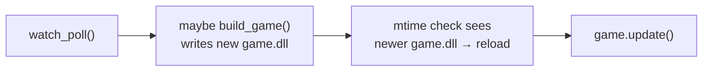

# 04 — Wiring, CMake, Build & the One Gotcha

Watcher and builder exist. Now glue them into `main.c`, feed `build.c` its paths from CMake, build, and learn the one environment trap your "direct compiler" choice introduces.

## The change router (`main.c`, above `main`)

```c
typedef struct HotState {
    bool code_dirty;
    bool shader_dirty;   // Phase B
    uint64_t dirty_at;   // ms of the last change, for debounce
} HotState;

static bool has_suffix(const char *s, const char *suf) {
    size_t ls = SDL_strlen(s), lf = SDL_strlen(suf);
    return ls >= lf && SDL_strcmp(s + ls - lf, suf) == 0;
}

static void on_file_changed(const char *name, void *user) {
    HotState *hs = (HotState *)user;
    if (has_suffix(name, ".c") || has_suffix(name, ".h")) {
        hs->code_dirty = true; hs->dirty_at = SDL_GetTicks();
    } else if (has_suffix(name, ".hlsl")) {
        hs->shader_dirty = true; hs->dirty_at = SDL_GetTicks();
    }
}
```

This is the **policy** the watcher deliberately left out (doc 02). The callback runs on the main thread (from `watch_poll`), so it only flips flags — cheap and race-free. It does **not** build here. Why separate "a file changed" from "do the build"? Debounce.

## Why debounce

One save can fire several events; some editors touch the file several times within milliseconds. If we built on the first event we'd compile a half-written file and/or build 3× per save. Instead the callback just records *when* the last change landed (`dirty_at`), and the loop waits for the dust to settle:

```c
if (watcher) watch_poll(watcher);
const uint64_t tick = SDL_GetTicks();
if (hot.code_dirty && tick - hot.dirty_at > 120) {   // 120 ms of quiet
    hot.code_dirty = false;
    SDL_Log("[hotbuild] change detected, rebuilding...");
    if (build_game()) SDL_Log("[hotbuild] build OK");
    else              SDL_Log("[hotbuild] build FAILED, keeping current code");
}
```

Every new event pushes `dirty_at` forward, so a burst of saves collapses into **one** build that fires 120 ms after the *last* event — by which point the editor has finished writing. 120 ms is comfortably below human reaction time, so it still feels instant.

Place this block **before** the existing `if (source_write_time() != game.last_write)` reload check. Order of one frame:



On a **failed** build, `game.dll` isn't rewritten, the mtime check sees nothing new, and the old code keeps rendering — you stay live while you read the error and fix it. That graceful "errors don't crash the session" behavior is a direct consequence of keeping build and reload decoupled (doc 03).

## Create and destroy the watcher

After the game loads successfully:

```c
HotState hot; SDL_zero(hot);
Watcher *watcher = watch_create(HOTBUILD_WATCH_DIR, on_file_changed, &hot);
if (watcher) SDL_Log("[hotbuild] watching %s (%s)", HOTBUILD_WATCH_DIR, watch_backend(watcher));
else         SDL_Log("[hotbuild] watcher failed; auto-build off");
```

Logging `watch_backend(watcher)` tells you at a glance whether you're on the native API (`ReadDirectoryChangesW`) or fell back to `poll` — invaluable when something doesn't trigger. And before `SDL_Quit()`:

```c
if (watcher) watch_destroy(watcher);
```

`SDL_zero(hot)` matters: an uninitialized `dirty_at`/`code_dirty` could trigger a phantom build on frame one.

## CMake: injecting the toolchain (`CMakeLists.txt`)

This is what lets `build.c` stay path-free. After the existing `target_compile_definitions(engine ...)`:

```cmake
target_sources(engine PRIVATE src/watch.c src/build.c)

if(MSVC)
    set(HOTBUILD_MSVC 1)
else()
    set(HOTBUILD_MSVC 0)
endif()

target_compile_definitions(engine PRIVATE
    HOTBUILD_MSVC=${HOTBUILD_MSVC}
    HOTBUILD_MSVC_CRT="$<IF:$<CONFIG:Debug>,/MDd,/MD>"
    HOTBUILD_CC="${CMAKE_C_COMPILER}"
    HOTBUILD_SRC="${CMAKE_CURRENT_SOURCE_DIR}/src/game.c"
    HOTBUILD_OUT="$<TARGET_FILE:game>"
    HOTBUILD_OBJ="$<TARGET_FILE_DIR:game>/game_hot.obj"
    HOTBUILD_GAME_INC="${CMAKE_CURRENT_SOURCE_DIR}/src"
    HOTBUILD_SDL_INC="${sdl3_SOURCE_DIR}/include"
    HOTBUILD_SDL_LINK="$<TARGET_LINKER_FILE:SDL3::SDL3-shared>"
    HOTBUILD_WATCH_DIR="${CMAKE_CURRENT_SOURCE_DIR}/src"
)
```

What each gives you, and why CMake is the right source for it:

- **`HOTBUILD_CC = ${CMAKE_C_COMPILER}`** — the *exact* compiler CMake resolved (full path to `cl.exe`/`cc`). Your runtime rebuild uses the same compiler as the main build — no drift.
- **`$<TARGET_FILE:game>`**, **`$<TARGET_FILE_DIR:game>`** — generator expressions resolved at build time to the real `game.dll` path and its directory. We rebuild to the *same* path the engine watches and the same place `game_active.dll` is copied from. If you change output dirs later, these follow automatically.
- **`${sdl3_SOURCE_DIR}/include`** — FetchContent sets `sdl3_SOURCE_DIR` after `MakeAvailable`; the public `<SDL3/SDL.h>` lives under `include/`. We point the rebuild's `-I` there.
- **`$<TARGET_LINKER_FILE:SDL3::SDL3-shared>`** — the link artifact: the `SDL3.lib` import lib on Windows, the `.so`/`.dylib` elsewhere. Exactly what the game must link against.
- **`HOTBUILD_MSVC_CRT`** — the per-config CRT flag (doc 03).

The pattern to internalize: **CMake owns the facts (paths, compiler, config); `build.c` owns the grammar (flag syntax).** Neither duplicates the other.

## Build & run

```
cmake --build out/build/x64-debug --target engine game
```

(Reconfigure first if CMake doesn't auto-pick the new `CMakeLists.txt`.) Then run `engine.exe`, edit `src/game.c` (e.g. change `speed_g`), save. Expected terminal flow:

```
[hotbuild] change detected, rebuilding...
[hotbuild] compiler: ...
[hotbuild] build OK
```

and the clear-color animation shifts without a restart. Now introduce an error (`int x = ;`), save:

```
[hotbuild] compiler: game.c(NN): error C2059: syntax error ...
[hotbuild] build FAILED, keeping current code
```

— old code keeps running. That's the whole feature working end to end.

## ⚠️ The one gotcha: `cl` needs its environment

Your "direct compiler" choice has a real consequence. `cl.exe` finds the CRT/Windows-SDK headers (`<stddef.h>`) and libs through the `INCLUDE`/`LIB` environment variables that **vcvars / the VS Dev Shell** set. `SDL_CreateProcess` gives the child the **engine's** environment. So:

- Launch `engine.exe` from a **VS Developer shell**, or from **CLion/VS** (both set that env) → `cl` works.
- Double-click `engine.exe` from Explorer, or run from a bare shell → `cl` can't find `<stddef.h>`, the build fails with a clear compiler error in the terminal (not a crash — the `else` branch keeps you live).

This is inherent to calling `cl` directly; `cmake --build` wouldn't have it (CMake re-establishes the toolchain). Two ways to live with it:

1. **Just always launch from a dev shell / IDE.** Simplest; what most engine devs do.
2. **Make the engine env-independent** later: have CMake also inject `CMAKE_C_IMPLICIT_INCLUDE_DIRECTORIES` and the lib dirs as defines, and add them as explicit `/I`/`/LIBPATH` in `build.c`. More work, but then a bare double-click rebuilds too.

Start with (1). If it bites, (2) is a contained follow-up.

## Where Phase B plugs in

`HotState.shader_dirty` and the `.hlsl` branch are already here, unused. Phase B (shadercross) fills in: on `shader_dirty`, recompile the changed HLSL → SPIRV/DXIL/MSL and hand the game new `SDL_GPUShader`s — the same watch→debounce→rebuild→reload shape you just built for code, applied to shaders.
