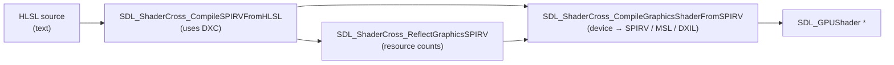

# 05 — Shaders: SDL_shadercross (Phase B)

Goal: author shaders in **HLSL**, compile them to the device's native format **at runtime**, and hot-reload them on save — the same watch → debounce → rebuild → reload loop from Phase A, now applied to `.hlsl` files. One HLSL source feeds Vulkan (SPIRV) on Linux/Pi5, Metal (MSL) on macOS, and D3D12 (DXIL) on Windows, because shadercross transpiles per device.

> ⚠️ **Read the "Pi5 / DXC reality check" section at the bottom before you commit to this.** It's the one part that can bite on Raspberry Pi.

## What shadercross actually gives us (verified against the current header)

There is **no** single "HLSL → `SDL_GPUShader`" function. The real runtime pipeline is three calls:



Why three steps and not one:

1. **HLSL → SPIRV** (`CompileSPIRVFromHLSL`). DXC (the DirectX Shader Compiler) is the only HLSL frontend shadercross has. It emits SPIRV. This is the step that needs DXC present at build/run time.
2. **Reflect** (`ReflectGraphicsSPIRV`). To create an `SDL_GPUShader` SDL must know how many samplers / storage textures / storage buffers / uniform buffers the shader uses. Rather than make you hand-count and keep them in sync with the shader, shadercross reads them back out of the SPIRV. That reflected `resource_info` feeds the next call.
3. **SPIRV → device shader** (`CompileGraphicsShaderFromSPIRV`). Given your `SDL_GPUDevice`, shadercross looks at the device's format and **transpiles**: passes SPIRV straight through for Vulkan, converts to MSL for Metal, to DXIL for D3D12. This is the cross-platform payoff — author once in HLSL, run everywhere.

### Exact signatures (from the header, don't trust memory)

```c
bool  SDL_ShaderCross_Init(void);
void  SDL_ShaderCross_Quit(void);

void *SDL_ShaderCross_CompileSPIRVFromHLSL(const SDL_ShaderCross_HLSL_Info *info, size_t *size);

SDL_ShaderCross_GraphicsShaderMetadata *
      SDL_ShaderCross_ReflectGraphicsSPIRV(const Uint8 *bytecode, size_t bytecode_size, SDL_PropertiesID props);

SDL_GPUShader *
      SDL_ShaderCross_CompileGraphicsShaderFromSPIRV(
          SDL_GPUDevice *device,
          const SDL_ShaderCross_SPIRV_Info *info,
          const SDL_ShaderCross_GraphicsShaderResourceInfo *resource_info,
          SDL_PropertiesID props);
```

```c
typedef struct SDL_ShaderCross_HLSL_Info {
    const char *source;            // null-terminated HLSL text
    const char *entrypoint;        // e.g. "main"
    const char *include_dir;       // dir for #include resolution (or NULL)
    SDL_ShaderCross_HLSL_Define *defines;   // {char *name; char *value;} array, or NULL
    SDL_ShaderCross_ShaderStage shader_stage;
    SDL_PropertiesID props;        // 0 = none
} SDL_ShaderCross_HLSL_Info;

typedef struct SDL_ShaderCross_SPIRV_Info {
    const Uint8 *bytecode;
    size_t bytecode_size;
    const char *entrypoint;
    SDL_ShaderCross_ShaderStage shader_stage;
    SDL_PropertiesID props;
} SDL_ShaderCross_SPIRV_Info;

// GraphicsShaderMetadata.resource_info is this:
typedef struct SDL_ShaderCross_GraphicsShaderResourceInfo {
    Uint32 num_samplers;
    Uint32 num_storage_textures;
    Uint32 num_storage_buffers;
    Uint32 num_uniform_buffers;
} SDL_ShaderCross_GraphicsShaderResourceInfo;

typedef enum SDL_ShaderCross_ShaderStage {
    SDL_SHADERCROSS_SHADERSTAGE_VERTEX,
    SDL_SHADERCROSS_SHADERSTAGE_FRAGMENT,
    SDL_SHADERCROSS_SHADERSTAGE_COMPUTE
} SDL_ShaderCross_ShaderStage;
```

`CompileSPIRVFromHLSL` returns a `SDL_malloc`'d buffer → you `SDL_free` it. `ReflectGraphicsSPIRV` returns a `SDL_malloc`'d metadata struct → you `SDL_free` it too.

## Who owns what: engine vs game DLL

The game DLL builds the pipelines (it knows its vertex layout and render state). The engine owns shadercross. We do **not** want to link shadercross into the hot-reloaded game DLL — that would bloat every rebuild and pull DXC into the plugin. So the engine exposes a **service function pointer** the game calls:

```mermaid
flowchart LR
    subgraph game["game.dll (hot-reloaded)"]
        gu["game_update / pipeline build"]
    end
    subgraph engine["engine.exe (owns shadercross + DXC)"]
        ls["shader_load()"]
    end
    gu -->|"mem->services.load_shader(device, \"x.vert.hlsl\", VERTEX)"| ls
    ls -->|"SDL_GPUShader *"| gu
```

The game stays light: it includes `game.h`, calls one function pointer, never references a shadercross symbol, never links it. The engine keeps DXC and the whole transpile machinery on its side of the boundary.

To avoid coupling `game.h` to shadercross headers, we define our **own** tiny stage enum in `game.h` and let the engine map it. The game never sees `SDL_ShaderCross_*` types.

## Edit 1 — `game.h`: stage enum, services, dirty flag

Add near the other typedefs:

```c
typedef enum ShaderStage {
    SHADER_STAGE_VERTEX,
    SHADER_STAGE_FRAGMENT
} ShaderStage;

typedef struct GameServices {
    // Compile an HLSL file (under the engine's shader dir) into a device shader.
    // Returns NULL on failure; the engine logs the compiler error.
    SDL_GPUShader *(*load_shader)(SDL_GPUDevice *device, const char *name, ShaderStage stage);
} GameServices;
```

Add two fields to `GameMemory`:

```c
    GameServices services;   // engine-provided callbacks
    bool shaders_dirty;      // engine sets when a .hlsl changed; game rebuilds pipelines
```

`shaders_dirty` mirrors the existing `reloaded` flag: the engine raises it, the game reacts in `game_update`, the engine clears it after. The game decides *how* to rebuild (which is why the engine can't do it) — it just gets told *when*.

## Edit 2 — `src/shader.h` (new)

```c
#ifndef SHADER_H
#define SHADER_H
#include "game.h"

bool shader_system_init(void);     // wraps SDL_ShaderCross_Init
void shader_system_quit(void);

// The function the engine plugs into GameServices.load_shader.
SDL_GPUShader *shader_load(SDL_GPUDevice *device, const char *name, ShaderStage stage);

#endif
```

## Edit 3 — `src/shader.c` (new)

```c
#include "shader.h"
#include <SDL3/SDL.h>
#include <SDL3_shadercross/SDL_shadercross.h>

#ifndef HOTBUILD_SHADER_DIR
#define HOTBUILD_SHADER_DIR "assets/shaders"
#endif

bool shader_system_init(void) {
    if (!SDL_ShaderCross_Init()) {
        SDL_Log("[shader] SDL_ShaderCross_Init failed: %s", SDL_GetError());
        return false;
    }
    return true;
}
void shader_system_quit(void) { SDL_ShaderCross_Quit(); }

static SDL_ShaderCross_ShaderStage map_stage(ShaderStage s) {
    return (s == SHADER_STAGE_VERTEX)
        ? SDL_SHADERCROSS_SHADERSTAGE_VERTEX
        : SDL_SHADERCROSS_SHADERSTAGE_FRAGMENT;
}

SDL_GPUShader *shader_load(SDL_GPUDevice *device, const char *name, ShaderStage stage) {
    char path[1024];
    SDL_snprintf(path, sizeof(path), "%s/%s", HOTBUILD_SHADER_DIR, name);

    // SDL_LoadFile null-terminates the buffer for us -> valid C string for DXC.
    size_t src_size = 0;
    char *source = (char *)SDL_LoadFile(path, &src_size);
    if (!source) {
        SDL_Log("[shader] cannot read %s: %s", path, SDL_GetError());
        return NULL;
    }

    // 1) HLSL -> SPIRV (DXC)
    SDL_ShaderCross_HLSL_Info hlsl;
    SDL_zero(hlsl);
    hlsl.source      = source;
    hlsl.entrypoint  = "main";
    hlsl.include_dir = HOTBUILD_SHADER_DIR;     // so #include "common.hlsli" resolves
    hlsl.shader_stage = map_stage(stage);

    size_t spirv_size = 0;
    void *spirv = SDL_ShaderCross_CompileSPIRVFromHLSL(&hlsl, &spirv_size);
    SDL_free(source);
    if (!spirv) {
        SDL_Log("[shader] HLSL->SPIRV failed for %s: %s", name, SDL_GetError());
        return NULL;
    }

    // 2) reflect resource counts out of the SPIRV
    SDL_ShaderCross_GraphicsShaderMetadata *meta =
        SDL_ShaderCross_ReflectGraphicsSPIRV((const Uint8 *)spirv, spirv_size, 0);
    if (!meta) {
        SDL_Log("[shader] reflect failed for %s: %s", name, SDL_GetError());
        SDL_free(spirv);
        return NULL;
    }

    // 3) SPIRV -> device shader (transpiles to MSL/DXIL or passes SPIRV through)
    SDL_ShaderCross_SPIRV_Info info;
    SDL_zero(info);
    info.bytecode      = (const Uint8 *)spirv;
    info.bytecode_size = spirv_size;
    info.entrypoint    = "main";
    info.shader_stage  = map_stage(stage);

    SDL_GPUShader *shader = SDL_ShaderCross_CompileGraphicsShaderFromSPIRV(
        device, &info, &meta->resource_info, 0);

    SDL_free(meta);
    SDL_free(spirv);

    if (!shader)
        SDL_Log("[shader] device compile failed for %s: %s", name, SDL_GetError());
    return shader;
}
```

Notes:

- **`SDL_LoadFile` null-terminates** — its docs guarantee a trailing zero byte (excluded from `datasize`), so the buffer is a ready C string for DXC. No manual copy needed.
- **Free order matters only for liveness, not correctness here**: we free `source` right after step 1 (DXC copied what it needs), then free `spirv` and `meta` after step 3 (both are inputs to step 3, so they must outlive it). Freeing `spirv` too early would feed step 3 a dangling pointer.
- **`include_dir`** lets you factor shared HLSL into `.hlsli` headers — handy as the engine grows.
- Every failure logs `SDL_GetError()` and returns `NULL`, so a broken shader on save prints a clear reason and the old pipeline keeps running (the game checks for NULL and keeps its current shader).

## Edit 4 — `src/main.c`: plug in services, watch shaders, signal reload

Add include + a shader-dir fallback near the top:

```c
#include "shader.h"
#ifndef HOTBUILD_SHADER_DIR
#define HOTBUILD_SHADER_DIR "assets/shaders"
#endif
```

After `SDL_Init`, before loading the game:

```c
if (!shader_system_init()) return 1;   // DXC ready
```

When filling `mem`, wire the service:

```c
mem.services.load_shader = shader_load;
```

Create a **second** watcher for the shader dir (the existing `on_file_changed` already routes `.hlsl` to `shader_dirty`):

```c
Watcher *shader_watcher = watch_create(HOTBUILD_SHADER_DIR, on_file_changed, &hot);
if (shader_watcher) SDL_Log("[hotshader] watching %s (%s)",
                            HOTBUILD_SHADER_DIR, watch_backend(shader_watcher));
```

In the loop, poll it and handle the dirty flag (next to the code-build block):

```c
if (shader_watcher) watch_poll(shader_watcher);
if (hot.shader_dirty && tick - hot.dirty_at > 120) {
    hot.shader_dirty = false;
    SDL_WaitForGPUIdle(device);     // no in-flight work referencing old shaders/pipelines
    mem.shaders_dirty = true;       // game rebuilds its pipelines this frame
    SDL_Log("[hotshader] reloading shaders");
}
```

After `game.update(&mem)`, clear it like `reloaded`:

```c
mem.reloaded = false;
mem.shaders_dirty = false;
```

Teardown:

```c
if (shader_watcher) watch_destroy(shader_watcher);
shader_system_quit();
```

**Why `SDL_WaitForGPUIdle` before raising the flag:** the GPU may still be executing a command buffer that references the current pipeline/shaders. If the game releases and recreates them while the GPU reads them, you get a use-after-free on the GPU. Idling first is the same guard the engine already uses around code reload.

## Edit 5 — the game reacts (example, you write the real one)

This is *your* code — shown only so the contract is concrete. In `game_update`, near the top:

```c
if (mem->shaders_dirty || !s->pipeline) {
    SDL_GPUShader *vs = mem->services.load_shader(mem->device, "tri.vert.hlsl", SHADER_STAGE_VERTEX);
    SDL_GPUShader *fs = mem->services.load_shader(mem->device, "tri.frag.hlsl", SHADER_STAGE_FRAGMENT);
    if (vs && fs) {
        if (s->pipeline) SDL_ReleaseGPUGraphicsPipeline(mem->device, s->pipeline);
        s->pipeline = /* SDL_CreateGPUGraphicsPipeline(...) using vs, fs ... */;
        SDL_ReleaseGPUShader(mem->device, vs);   // pipeline holds its own ref
        SDL_ReleaseGPUShader(mem->device, fs);
    } // else: keep the old pipeline; load_shader already logged the error
}
```

The pattern: on `shaders_dirty` (or first run), recompile, build a fresh pipeline, release the old one, and **on failure keep what you had** — a typo in a shader never kills the session, it just prints the error and leaves the last-good pipeline up.

## Edit 6 — `CMakeLists.txt`: fetch, configure, link, deploy

Alongside the SDL3 FetchContent block:

```cmake
set(SDLSHADERCROSS_CLI     OFF CACHE BOOL "" FORCE)   # we want the lib, not the CLI tool
set(SDLSHADERCROSS_TESTS   OFF CACHE BOOL "" FORCE)
set(SDLSHADERCROSS_INSTALL OFF CACHE BOOL "" FORCE)
set(SDLSHADERCROSS_VENDORED ON CACHE BOOL "" FORCE)   # build DXC + SPIRV-Cross from submodules
set(SDLSHADERCROSS_SPIRVCROSS_SHARED OFF CACHE BOOL "" FORCE)  # fold SPIRV-Cross in, fewer DLLs

FetchContent_Declare(SDL3_shadercross
    GIT_REPOSITORY https://github.com/libsdl-org/SDL_shadercross
    GIT_TAG main)
FetchContent_MakeAvailable(SDL3_shadercross)
```

Add the source, link the lib, define the shader dir:

```cmake
target_sources(engine PRIVATE src/watch.c src/build.c src/shader.c)
target_link_libraries(engine PRIVATE SDL3::SDL3 SDL3_shadercross::SDL3_shadercross)

target_compile_definitions(engine PRIVATE
    # ...existing HOTBUILD_* defines...
    HOTBUILD_SHADER_DIR="${CMAKE_CURRENT_SOURCE_DIR}/assets/shaders"
)
```

Copy the runtime DLLs next to `engine.exe` (extend the existing POST_BUILD copy):

```cmake
add_custom_command(TARGET engine POST_BUILD
    COMMAND ${CMAKE_COMMAND} -E copy_if_different
        $<TARGET_FILE:SDL3::SDL3-shared> $<TARGET_FILE_DIR:engine>
    COMMAND ${CMAKE_COMMAND} -E copy_if_different
        $<TARGET_FILE:SDL3_shadercross-shared> $<TARGET_FILE_DIR:engine>
    VERBATIM)
```

**You still need `dxcompiler.dll` (Windows) / `libdxcompiler.so` (Linux) beside the binary.** DXC is loaded *dynamically* by shadercross at runtime — it is not statically linked. The vendored build produces it under the shadercross build dir; add a `copy_if_different` for it once you confirm its path (it varies by version, so check `out/build/.../_deps/` after the first configure rather than guessing). On Windows you may also need `dxil.dll` for shader signing (DXIL path / D3D12); for the Vulkan-SPIRV path it isn't required.

## Pi5 / DXC reality check (read this)

Everything above hinges on DXC, and DXC is the soft spot on Raspberry Pi:

- **DXC is the only HLSL frontend.** `SDLSHADERCROSS_DXC=OFF` removes HLSL input entirely (you'd be left feeding SPIRV directly) — so for "author in HLSL," DXC must be present on every target, **including arm64**.
- **`SDLSHADERCROSS_VENDORED=ON` builds DXC from source** (it's an LLVM fork). That *does* build on arm64 Linux, but it's **heavy** — a large clone and a long compile that can be brutal on a Pi5. Practical options:
  1. **Cross-compile** the Pi5 binaries (incl. DXC) on a fast x86_64 box with an aarch64 toolchain — recommended.
  2. Build once natively on the Pi (slow, but a one-time cost), or on a beefier arm64 machine.
  3. Use a system/prebuilt `libdxcompiler.so` for aarch64 if you can source one, and set `SDLSHADERCROSS_VENDORED=OFF` with system SPIRV-Cross + DXC.
- The prebuilt-download path (`SDLSHADERCROSS_INSTALL_RUNTIME`) is oriented at x86_64/Windows; don't count on it for aarch64.
- **First Windows configure is also slow** — FetchContent will clone shadercross *and its submodules* (DirectXShaderCompiler, SPIRV-Cross) and build them. Expect the first `cmake` to take minutes. Subsequent builds are fast (the deps are cached in `_deps/`).

If the Pi build proves painful, a clean fallback that keeps HLSL authoring: **precompile HLSL→SPIRV offline** (on a dev box, via the shadercross CLI) and ship `.spv` to the Pi, where the engine skips step 1 and calls `CompileGraphicsShaderFromSPIRV` directly — no DXC on the Pi at all. That's the other option you weighed earlier; it stays available as a per-platform switch without changing the shader authoring.

## Sources

- [SDL_shadercross repo](https://github.com/libsdl-org/SDL_shadercross)
- [DeepWiki: runtime dependencies](https://deepwiki.com/libsdl-org/SDL_shadercross/5.4-runtime-dependencies)
- [DeepWiki: platform-specific builds](https://deepwiki.com/libsdl-org/SDL_shadercross/5.3-platform-specific-builds)
- [Issue #111: DirectX required to compile to SPIR-V](https://github.com/libsdl-org/SDL_shadercross/issues/111)
