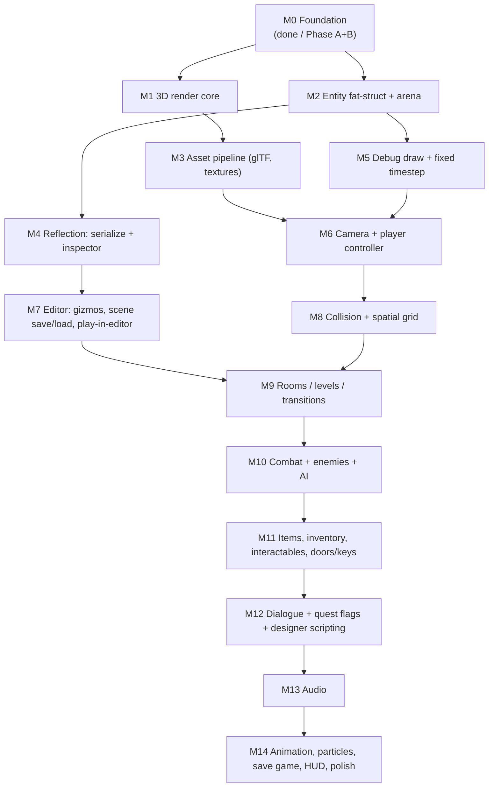

# 06 — Implementation Roadmap

A rough ordering of systems for a **data-oriented 3D action-adventure engine** (Casey-style fat entity struct) building toward a Zelda: Link's Awakening–style game, with an **editor for designers**.

This is a sequence of *vertical slices* — each milestone ends with something runnable you (and a designer) can poke at. Order is driven by **dependencies** and by **getting designers unblocked early**, not by building whole systems to completion before moving on. Almost everything co-evolves; the editor especially grows every milestone.

## Guiding constraints (they shape the order)

- **Fat struct / DOD.** One big `Entity` struct holding every possible component as fields, a flat `Entity entities[MAX]` array, and a `flags` bitfield saying which components are "on." Systems are loops over that array. This makes three things cheap *if you plan for them*: serialization (dump the array), the editor inspector (walk the struct), and hot-reload (state is plain data in the arena). Plan for them from M2.
- **Hot-reload is already your superpower.** Gameplay lives in `game.dll`; keep *all* gameplay logic and the entity array in the arena so a recompile never loses world state. Engine-side (window, GPU, asset cache) lives in `engine.exe`.
- **Designers need the editor sooner than feels comfortable.** The answer isn't "build the editor first" — it's "build a *tiny* inspector at M2 and never stop growing it." Don't gate gameplay on a finished editor.
- **Zelda LA target = 3D tilt-shift, top-down-ish camera.** Movement on a ground plane, room-to-room screens, sword combat, items/keys/doors, push-block puzzles, NPCs + dialogue, hearts. That feature list is the back half of this roadmap.

## Dependency map

The critical spine: **M1/M2 → M4 (reflection) → M7 (editor) → M9 (rooms) → M10–12 (gameplay)**. Reflection (M4) is the keystone — it pays for both saving *and* the inspector, so do it once, early, before you've hand-written either.

---

## M0 — Foundation ✅ (in progress)

Window, `SDL_GPUDevice`, hot-reload DLL, **auto-build** (Phase A), **shadercross** (Phase B), clear-color frame. You're here. Finish A then B, confirm reload survives a save.

---

## M1 — 3D render core

**Goal:** a lit, textured mesh on screen with a moving 3D camera and depth.

- Vertex/index buffers, a depth-stencil target (you currently only clear color).
- Math: `vec2/3/4`, `mat4`, quaternion, transform → MVP. (Roll your own small `math.h`; it's hot-reloadable data.)
- One basic shader set (HLSL via shadercross): transformed, single directional light, one texture.
- Per-frame uniform buffer (view/proj), per-draw (model matrix).

**Why now:** nothing is visible or placeable until you can draw a transformed mesh. **Slice:** a textured cube spinning under a camera you can orbit.

---

## M2 — Entity fat struct + arena layout

**Goal:** the data model everything else hangs off.

- Define the `Entity` fat struct: `flags`, `Transform` (pos/rot/scale), and stubs for the components you *know* are coming (render/mesh id, collider, health, ...). Add fields as needed — don't predesign all of them.
- `Entity entities[MAX_ENTITIES]` + `count` living **in the arena** (so hot-reload keeps the world).
- **Handles, not pointers:** an entity is referenced by `{index, generation}`. `generation` bumps on despawn so stale handles are detectable. This is non-negotiable for serialization and for the editor — pointers can't be saved or survive a reload; handles can.
- Spawn/despawn (free-list or swap-remove), and the master update loop iterating by flag.

**Why now:** it's the substrate for rendering instances, the editor, and saving. **Slice:** spawn 100 cubes from data, each its own transform, all drawn in M1's pipeline.

---

## M3 — Asset pipeline

**Goal:** load real models/textures instead of hardcoded cubes.

- glTF mesh import (use `cgltf` — small, C, fits). Texture loading (`stb_image` or SDL_image).
- An asset cache keyed by path/id; entities store an **asset id**, not the data.
- **Asset hot-reload** via your existing watcher: re-import on file change, swap in the cache. Designers iterate on art without restarting.

**Why now:** the editor and levels need a library of things to place. **Slice:** drop a `.gltf` in `assets/`, see it appear; edit the texture, watch it update live.

---

## M4 — Reflection: serialization + inspector (the keystone)

**Goal:** describe the `Entity` struct *once* as data; generate save/load and the inspector from it.

- A member table: `{ name, type, offset, size }` per field (hand-written, or macro/codegen later). The fat struct makes this tractable — it's one struct.
- **Serializer:** walk the table → write the entity array to a file (handles serialize fine; asset ids serialize fine). Versioning from day one.
- **Inspector data source:** the same table feeds a generic "show every field of the selected entity" UI in M7.

**Why now, before the editor:** if you hand-write the inspector *and* the serializer, you maintain the field list in three places (struct, save, UI) and they drift. One reflection table = one source of truth. This is the highest-leverage decision in the roadmap.

**Slice:** save the 100-cube scene, reload it byte-identical.

---

## M5 — Debug draw + fixed timestep

**Goal:** see invisible things; make gameplay deterministic.

- Immediate-mode debug lines/boxes/spheres (`debug_line(a,b,color)`), drawn once per frame, no retained state. You will use this constantly for colliders, AI, paths.
- Fixed-timestep accumulator for gameplay (decouple sim from render). Zelda-style movement/collision wants determinism; hot-reload + fixed step also makes bugs reproducible.

**Why now:** cheap, and every later system (collision, AI, camera) is far easier to debug with it in place. Do it before M8.

---

## M6 — Camera + player controller

**Goal:** drive a character around the world.

- Tilt-shift / top-down-ish camera (Link's Awakening remake look): fixed-ish angle, follows player, maybe room-snapping later.
- Player entity: input → velocity → position. 8-way or analog movement on the ground plane.

**Why now:** turns the engine into something you *play*, and gives the editor a "play" target. **Slice:** walk a character around a flat world with the camera trailing.

---

## M7 — Editor: gizmos, scene save/load, play-in-editor

**Goal:** designers can build and tweak scenes without you.

- Integrate **Dear ImGui** with the SDL_GPU backend (don't hand-roll UI yet; ImGui is the pragmatic choice and is C++-callable from a thin layer). Or a minimal custom IMGUI if you insist on pure C — but that's a detour.
- Entity list + **inspector driven by the M4 reflection table** (edit any field live).
- Transform **gizmos** (translate/rotate/scale), picking (ray vs entity).
- Scene **save/load** (M4 serializer) and a **play / pause / step** toggle that runs the game loop in a viewport.
- Spawn-from-asset-library panel (M3).

**Why now:** M1–M6 give it something to show, place, and run; M4 gives it save + inspect for free. **Slice:** a designer opens the editor, places three meshes, sets a field, saves, hits play, walks around it.

> From here on, **every milestone also adds its component's fields to the inspector** — combat tuning, AI params, trigger targets. The editor grows with the game.

---

## M8 — Collision + spatial grid

**Goal:** solid world; things can't walk through walls.

- Shapes: AABB and capsule/sphere (Zelda movement is forgiving — capsule-vs-AABB world is plenty).
- Swept collision + slide response for movement; a uniform **grid** for broadphase (rooms are small, a grid is ideal and trivial).
- Triggers (overlap, non-blocking) — the basis for doors, pickups, room exits, cutscene volumes.

**Why now:** gameplay (combat, push blocks, doors) all sit on collision + triggers. **Slice:** player collides with walls, slides along them, and a trigger volume prints "entered."

---

## M9 — Rooms / levels / transitions

**Goal:** Link's-Awakening-style discrete rooms with screen transitions.

- A `Room`/`Level` is a serialized entity set (reuse M4/M7). Decide grid-of-screens vs streamed.
- Load/unload rooms; **screen transition** on exit triggers (the camera pan/cut between rooms is iconic).
- Spawn/persistence rules: what resets on re-entry vs what stays (opened doors, collected items → quest flags in M12).

**Why now:** combat and puzzles need a place to live, and designers need to author rooms. **Slice:** two rooms, walk through a doorway, camera transitions, second room loads.

---

## M10 — Combat + enemies + AI

**Goal:** the action half.

- Sword: attack states, **hitboxes vs hurtboxes** (use M8 overlaps + M5 debug draw heavily).
- Health/damage/knockback/i-frames; player hearts.
- Enemies as entities with a simple **state machine** AI (idle/patrol/chase/attack). Keep AI data in the fat struct so it serializes and reloads.

**Why now:** depends on collision (M8) and rooms (M9). **Slice:** a slime that chases and damages you; your sword kills it; hearts go down and up.

---

## M11 — Items, inventory, interactables, doors/keys

**Goal:** the adventure verbs.

- Pickups (rupees, hearts, key), inventory state (in the player entity / save data).
- Interactables: pots to lift/throw, **push blocks**, switches, locked doors + keys.
- Equippable items (sword, shield, bombs, bow) — an item id + use behavior.

**Why now:** these are the puzzle/progression vocabulary; they need combat, collision, triggers, rooms. **Slice:** a one-room puzzle — push a block onto a switch, a door opens, grab the key.

---

## M12 — Dialogue + quest flags + designer scripting

**Goal:** NPCs, story gates, designer-authored logic without C.

- Text boxes / dialogue trees (data files, editable in M7).
- **Quest/world flags** (a bitset in save data): "talked to X", "opened dungeon 1". Triggers/doors/NPCs read & write flags.
- A tiny **data-driven event system** so designers script "on trigger → play dialogue → set flag → open door" without touching the DLL. Keep it declarative.

**Why now:** ties rooms + items + NPCs into actual progression. **Slice:** an NPC blocks a path, asks for an item; give it, flag flips, path opens — authored entirely in the editor.

---

## M13 — Audio

**Goal:** SFX + music.

- SDL audio stream or **miniaudio** (one-file, easy). Sound ids as assets (M3), triggered from gameplay events (M12).
- Music with room/area changes; basic mixing/ducking.

**Why this late:** it's loosely coupled and best layered once events (M12) exist to drive it. Can slot earlier if a designer wants audio feedback sooner — low risk to move.

---

## M14 — Animation, particles, save game, HUD, polish

**Goal:** make it feel like a game.

- Skeletal animation (glTF skins) — vertex skinning shader; blend states (idle/walk/attack).
- Particles (impacts, dust, sparkles) on the M5 immediate path, instanced.
- **Save game** = the M4 serializer over player + world flags + room states. You already have the machinery.
- HUD (hearts, items, rupees), menus, pause, title.
- Juice: screen shake, hit-stop, transitions.

---

## How to actually walk this

1. **Don't finish systems — finish slices.** Each milestone's "Slice" is the done-bar. A 60%-complete collision system that makes the slice work beats a "complete" one with no game around it.
2. **Reflection (M4) before editor (M7).** The single most order-sensitive choice here.
3. **Handles + arena-resident world state from M2.** Retrofitting these later is painful; they're cheap up front and make save/reload/editor all "just work."
4. **Grow the inspector every milestone.** New component → new fields in the reflection table → it shows up in the editor automatically. That's the fat-struct + reflection dividend.
5. **Keep engine vs game split honest.** Anything a designer or you will tune at runtime lives in `game.dll` + the arena. Device, asset cache, OS glue stay in `engine.exe`.

### Designer-unblock checkpoints

- After **M7**: place objects, set fields, save, play.
- After **M9**: author rooms and transitions.
- After **M11**: build block/key/door puzzles.
- After **M12**: script NPCs, dialogue, and progression with no code.
