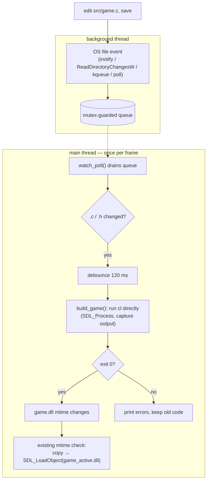

# Tutor: Hot-Reload Auto-Build System

These docs explain the auto-build + file-watch + hot-reload system you're adding to the engine. The goal: edit `src/game.c`, hit save, and watch the running engine rebuild the game DLL and swap in the new code without restarting — with compiler errors printed straight to the engine's terminal. Shaders (Phase B) get the same treatment.

You write all the code. Each doc explains **what** a snippet does and **why** it's built that way, so you can type it with understanding and change it later.

## The big picture

Two facts the design leans on, both already true in your `main.c` before this work:

1. **The engine loads a *copy* (`game_active.dll`), never `game.dll` itself.** So the compiler can overwrite `game.dll` at any time — it's never locked by the running engine.
2. **The reload trigger is already an mtime poll** on `game.dll`. The auto-builder doesn't need to call reload directly; it just needs the build to produce a newer `game.dll`, and the existing check picks it up next frame.

That's why the new code is *additive*: a watcher, a builder, and a few lines of glue. We don't rewrite the reload path.

## The 8 edits

| # | File | What | Doc |
|---|------|------|-----|
| 1 | `src/game.h` | Explicit `dllexport` on the entry points | [01-explicit-exports.md](01-explicit-exports.md) |
| 2 | `src/watch.h` | Watcher public interface | [02-file-watcher.md](02-file-watcher.md) |
| 3 | `src/watch.c` | Native backends + poll fallback | [02-file-watcher.md](02-file-watcher.md) |
| 4 | `src/build.h` | Builder interface | [03-auto-build.md](03-auto-build.md) |
| 5 | `src/build.c` | Direct compiler invocation via `SDL_Process` | [03-auto-build.md](03-auto-build.md) |
| 6 | `src/main.c` | Wire watcher → debounce → build → reload | [04-wiring.md](04-wiring.md) |
| 7 | `CMakeLists.txt` | Add sources + inject toolchain paths as defines | [04-wiring.md](04-wiring.md) |
| 8 | build & run | Verify; note the `cl` environment catch | [04-wiring.md](04-wiring.md) |

Read them in order. 01 is a real bug fix and the smallest; do it first and confirm reload still works before adding the watcher.

## Phase B — shaders

| File | What | Doc |
|------|------|-----|
| `game.h`, `src/shader.{h,c}`, `src/main.c`, `CMakeLists.txt` | HLSL → SPIRV → device shader at runtime via SDL_shadercross, hot-reloaded; same watch→debounce→reload shape applied to `.hlsl` | [05-shadercross.md](05-shadercross.md) |

Phase B reuses Phase A's watcher and `HotState.shader_dirty` flag. The catch is **DXC on Raspberry Pi arm64** — read the reality-check section in [05-shadercross.md](05-shadercross.md) before wiring it.

## Where this is going

[06-roadmap.md](06-roadmap.md) — milestone ordering for the whole engine: 3D render core → fat-struct entities → reflection (serialize + inspector) → editor → rooms → combat/items/dialogue. Driven by dependencies and getting designers unblocked early. The keystone is **reflection before editor** (M4 before M7).

[07-reading-order.md](07-reading-order.md) — what to read from your eleven books, mapped onto the roadmap milestones. Build-along vs reference vs theory; the big caveat is they teach OOP/scene-graph while you build fat-struct DOD — read for concepts, not code structure.

## Concepts (not in the build sequence)

Standalone background that the build docs lean on but don't depend on in order. Read whenever.

- [string-views.md](string-views.md) — why a pointer+length string beats a null-terminated `char *`: O(1) length, zero-copy slicing, bounds safety, the DOD/cache angle, and the 1970s history behind C's worse default. Underpins later asset-name and parser/reflection work.

## Read order if you're short on time

1. [01-explicit-exports.md](01-explicit-exports.md) — the bug, 2 minutes.
2. [03-auto-build.md](03-auto-build.md) — the heart: how a running program recompiles its own plugin.
3. [02-file-watcher.md](02-file-watcher.md) — the most code; the OS-event details.
4. [04-wiring.md](04-wiring.md) — glue + build + the launch-environment gotcha.
